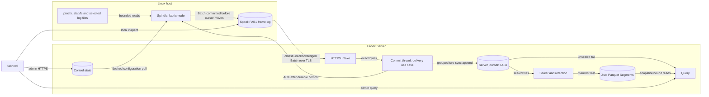

# Architecture documentation

FabricO11y is a Rust observability system: a Spindle on each Linux host collects metrics and logs into a durable Spool and delivers them over TLS to Fabric Server, which commits before acknowledging, retains history as a journal and Parquet Segments, and answers queries that report what is complete, fresh and missing. The architecture is hexagonal: a pure `no_std` semantic core, effect ports, application use cases, adapters and thin composition roots, with the dependency rule checked by `cargo xtask`.

<!-- diagram: diagrams/system.mmd -->

The canonical source is [system.mmd](diagrams/system.mmd); the documentation check detects differences between it and this copy.

## Source of truth

When documents disagree, the higher entry wins and the lower one is corrected:

| Priority | Source |
| --- | --- |
| 1 | [Product contract](PRODUCT-CONTRACT.md) |
| 2 | Accepted [architecture decisions](decisions/README.md) |
| 3 | Current [architecture views](architecture/README.md) |
| 4 | Registered experiment protocols and results under [experiments](experiments/README.md), and [qualification](QUALIFICATION.md) |
| 5 | [Current state](CURRENT.md) |
| 6 | Exploratory research: the [blueprint](architecture.md), the [generator-verifier digest](research/generator-verifier.md), the [query-engine direction review](research/query-engine-direction.md), the [frontier map](research/frontier-map.md), the [research ledger](research/ledger.md), the [storage direction](research/storage-direction.md) with its [prior-art survey](research/storage-prior-art.md), the [observation cost model](research/observation-model.md), and research experiments |

Implementation is evidence of what exists; none of these documents overrides it silently. A disagreement between code and a document is reconciled explicitly ([documentation policy](documentation-policy.md#19-relationship-between-code-and-documentation)).

## Read in this order

1. [Current state](CURRENT.md): what is implemented, what is outstanding, and the known risks.
2. [Product contract](PRODUCT-CONTRACT.md) and [qualification](QUALIFICATION.md): the promises, the registered gates and the capability ledger.
3. [System](architecture/system.md), then the [architecture views](architecture/README.md).
4. [Verification strategy](formal/verification-strategy.md) and [verification matrix](formal/verification-matrix.md): which technique checks which claim.
5. [Concepts](concepts/README.md) and [glossary](glossary.md).
6. [Architecture decisions](decisions/README.md).
7. [Experiments](experiments/README.md): registered protocols, results, formal checks and research.
8. [Roadmap](ROADMAP.md) and the [milestone records](milestones/architecture-foundation.md).

[Operating FabricO11y](operations.md) covers install, configuration, the admin CLI and recovery states. The [learning path](LEARNING_PATH.md) follows the Rust ideas and system contracts step by step. The [blueprint](architecture.md) is a proposal and research agenda; its pipelines, guarantees and example numbers do not describe completed work.

Use the [contributor guide](CONTRIBUTING.md) for workflows and checks. [AGENTS.md](../AGENTS.md) is the operational contract for coding agents; the full [documentation policy](documentation-policy.md) applies to everyone.
