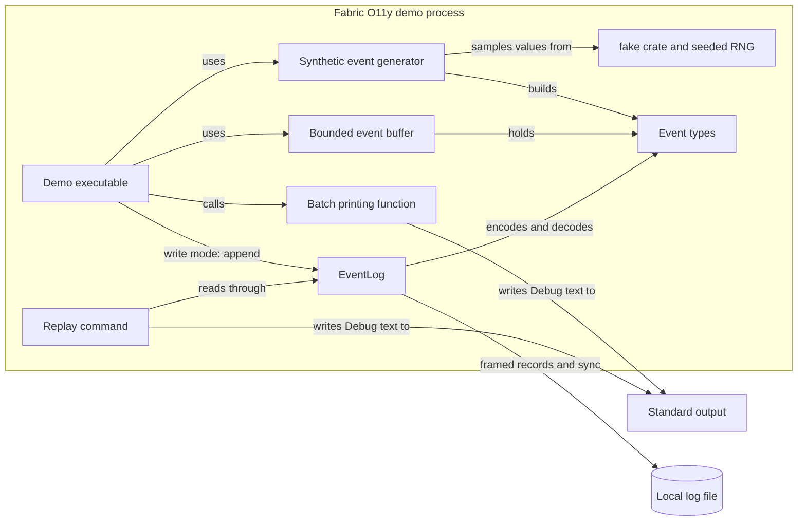

# Architecture documentation

The [controlled Linux alpha contract and phase ledger](ALPHA.md) tracks the
approved application work and its unpassed gates.

The original Fabric O11y demo generates repeatable synthetic events, buffers them, and prints or commits them to FOL2. Phase 1 now also has a local [native node and inspect path](architecture/node.md) under qualification. One Rust package provides these components; there is no network ingestion or query service. This diagram shows the original implemented demo boundary.

<!-- diagram: diagrams/system.mmd -->

The canonical source is [system.mmd](diagrams/system.mmd). The documentation check detects differences between that file and this copy. The [packet-slot transport simulator](../tools/transport-sim/README.md) is experimental tooling outside this application diagram.

## Read in this order

1. [Current project state](CURRENT.md): implemented behavior, assumptions, and open work.
2. [System architecture](architecture/system.md): boundaries, execution, and evidence.
   [Architecture views](architecture/README.md) links the application and research projections.
   [Planned Linux deployment](architecture/deployment.md) records the accepted phase-5 service boundary.
3. [Local input and batching](architecture/ingestion.md): data flow, full-buffer control flow, and ownership.
4. [Local storage](architecture/storage.md): frame format, commit point, and recovery limits.
5. [Delivery ownership](architecture/delivery.md): the Stage 4 model and its mapping to the local log.
6. [Concepts](concepts/README.md) and [glossary](glossary.md): the meaning of current types and the handoff.
7. [Architecture decisions](decisions/README.md): recorded rationale and its limits.
8. [Experiments](experiments/README.md): batch-size and local-log measurements, scoped formal and implementation checks, and H1/M2 simulation cells within the broader Homa/SIRD transport study.

The [learning path](LEARNING_PATH.md) organizes future increments. The [original architecture blueprint](architecture.md) is a proposal and research agenda; its pipelines, guarantees, and example results do not describe completed work. Add further architecture views when their components exist or a concrete design task needs them.

The optional [agent telemetry view](architecture/agent-telemetry.md) describes development tooling outside the Rust application.

The [observability storage research agenda](experiments/ablation/observability-storage-research.md) contains a sourced survey, the [S1 scan/pruning experiment](experiments/ablation/storage-query-s1-run-01.md), and proposed next cells. Its query probe is research tooling outside the application diagram. The [query research view](architecture/query.md) adds the coverage protocol and its separate trust assumptions.

The [local research prototype](architecture/research-prototype.md) now composes an offline Logs adapter, bounded FOL2 ingestion, immutable JSON snapshot publication, and root-bound query/resume. Its canonical [diagram](diagrams/research-prototype.mmd) is separate from the application system diagram. The [hybrid layout probe](../tools/layout-probe/README.md) compares Arrow/Parquet projection and postings under a separately registered protocol; no format winner is selected. The application still has no network ingestion or query service.

Use the [contributor guide](CONTRIBUTING.md) for skills, hooks, documentation validation, and editor recommendations. [AGENTS.md](../AGENTS.md) contains the repository instructions and full documentation policy.
