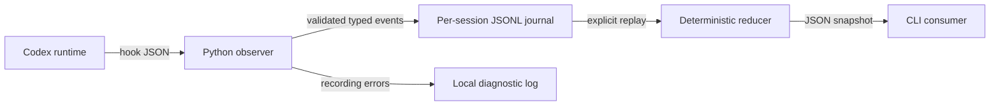

# Agent telemetry tooling

## Purpose and boundary

The [passive telemetry tool](../../tools/telemetry/README.md) exposes observed Codex activity as validated events and deterministic JSON snapshots. It is optional Python development tooling outside the Rust application. It neither collects Fabric O11y events nor changes the Rust learning milestone.

<!-- diagram: ../diagrams/agent-telemetry.mmd -->

## Contracts and failure behavior

The [event schema](../../tools/telemetry/event.schema.json) defines versioned variants with session, turn, operation, and event identity. The adapter copies only allowed fields. Command text, prompts, output, and transcripts are not stored. Runtime provenance is a label, not authentication.

A file lock serializes cooperating readers and writers for each session. Snapshot reduction correlates operations by turn and operation ID. Reordered starts cannot erase finishes; repeated event IDs are idempotent only if their contents match. Conflicting evidence and broken journals fail replay. Stop requests, interruptions, and session ends are historical flags, not proof of task completion or current liveness.

The observer returns no content to the model and does not block a tool on telemetry validation errors. Failures go to a local diagnostic when possible. Hook process startup still costs time; asynchronous hooks can be delayed, reordered, or cancelled. No completeness, durability, latency, or coding-quality guarantee is claimed. The [command documentation](../../tools/telemetry/README.md#runtime-integration-and-limits) records retention, input limits, and hook trust requirements.

## Evidence and future work

[Contract probes](../../tools/telemetry/test_contract.py) inject malformed records, conflicts, and reordered traces and exercise concurrent appenders. [CLI probes](../../tools/telemetry/test_cli.py) verify silent observation, dropped raw content, and explicit replay failure. [ADR-0003](../decisions/ADR-0003-observe-agent-activity-with-typed-events.md) records the boundary and correctness argument.

A scoped [Z3 investigation](../experiments/formal/agent-telemetry-merge.md) checks the operation-evidence algebra and compares a bounded trace corpus against the actual reducer. It does not verify runtime delivery or filesystem behavior.

A dashboard, semantic annotation tool, and structured replacement for the current project-context loader remain proposals. Live activation and model-quality comparisons require separate runtime evidence; direct script tests do not establish them.
