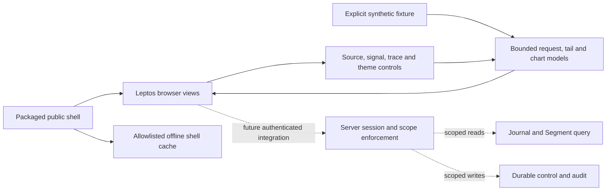

# Console algorithms

Status: finite model for the initial console crate; these local display algorithms
do not implement server authorization, cancellation, live transport or qualification.
The console must preserve the [query contract](retained-history.md) and
[identity boundary](identity-access.md). Pure model code is in
[model.rs](../../crates/fabric-ui/src/model.rs); deterministic counterexamples are
in [model tests](../../crates/fabric-ui/tests/model.rs).

<!-- diagram: ../diagrams/operator-console.mmd -->

## Request ownership

A coordinator owns at most one request token `(session, query, request)`.
Each epoch/counter is a checked unsigned 64-bit integer: exhaustion refuses the
transition without partial mutation, except failed login/account switch and logout
disable display authority when the session epoch cannot advance. Login/account change and logout advance
the session epoch; filter/query changes advance the query epoch. A completion
may update display only when its exact token matches both current epochs and
the live request, and the session is active. Unknown tokens never release work.

Invalidation retains the live token until its matching completion acknowledgement.
Thus changing filters or logging out rejects stale results but does not manufacture
another available request slot. A browser abort must not be interpreted as evidence
that a server blocking worker released its admission permit. If transport cannot
confirm completion, this coordinator remains busy; a real integration must define
server cancellation/status or rely on independently enforced server admission.
The model claims one locally tracked request, not one globally executing query.
Each transition is O(1), storage O(1). A counterexample is logout followed by login
while the old result arrives: the old result must be stale, never populate the new account.

## Bounded display tail

Rows have immutable identities `(enrollment, generation, batch sequence, signal,
ordinal)` and UTF-8 text. Capacity bounds both retained row count `K` (at most
4,096) and retained text bytes `B` (at most 1 MiB). Byte accounting uses Rust
string byte length, not Unicode scalar or displayed glyph count. Container and
identity metadata are separately O(K); these bounds do not claim process RSS.
Before retaining an accepted row, normalize its string capacity to its UTF-8
length through boxed-string ownership. A one-byte string with a huge spare
capacity must not retain that allocation. Duplicate/oversize rows are not copied.

For an identity still retained, equal text is a duplicate; differing text is a
conflict and neither replaces nor appends. Identity deduplication is bounded to
the retained window: an evicted identity can reappear. Oversized input or zero
capacity refuses the incoming row without evicting existing rows. Otherwise evict
oldest whole rows until both limits admit the new row. Each eviction and oversized
refusal increments a display-dropped counter; it is not an ingestion/collection gap
or a claim of server data loss. Duplicate/conflict refusals have distinct statuses.
The unsigned counter saturates with an explicit saturation flag, never wraps.

The deque scans at most K identities per append: O(K+L) worst case including
capacity normalization of L incoming bytes, with O(K+B) retained storage. Avoid a second payload copy/index at these
small fixed limits. Input ownership already exists before this model sees it:
the transport must bound decode/body allocation independently, including the
transient incoming allocation during normalization. Zero row or byte capacity
refuses even empty strings. A counterexample
is a four-byte emoji admitted to a three-byte buffer by counting characters.

## Poll scheduling

The pure schedule takes supplied monotonic milliseconds; it reads no clock.
`begin` consumes one due slot and refuses overlapping starts until `finish`.
The request coordinator must also be free before begin: timer completion or
browser abort is not request completion. Success schedules from completion time
(no accumulated catch-up polls), with a configured interval of 1–60,000 ms.
Retryable failures, including 429/503, use delays of 1, 2, 4, 8, 16, 32 then
60 seconds; further failures stay at 60 seconds. Effective delay is the maximum
of the healthy interval, backoff and supplied Retry-After. Failure cannot increase
polling pressure and a server-requested wait is never shortened. Review found the
counterexample of a 15 s healthy poll retried in 1 s; the model tests retain it.
The adapter parses Retry-After into nonnegative milliseconds; malformed values
fall back to backoff, never zero-delay loops. Success resets backoff. Terminal
status stops scheduling. Checked deadline overflow or clock rollback leaves no
due deadline; the integration must stop and report the error rather than restart
immediately. Logout disables scheduling through terminal completion; epochs
still reject any late result. State and each transition are O(1).

## Time and chart envelope

Input is at most 65,536 samples in nondecreasing unsigned integer nanoseconds,
inside an inclusive window `[a,b]` with `a < b`. Reject out-of-order/out-of-window
data and nonfinite numeric values. `None` represents an explicit gap marker;
an empty bucket is absence of samples, not invented collection-gap evidence.

Normalize time by integer subtraction before float conversion:
`x = float(t-a) / float(b-a)`. Converting large absolute timestamps to floats
first can erase nearby samples. Floats still have finite display precision; do
not use chart coordinates for query ordering or exact identity.
For P buckets, map `i = min(P-1, floor((t-a)*P/(b-a)))` using unsigned 128-bit
arithmetic; this handles the inclusive right edge without overflow. Require
`1 <= P <= 1,024`. One bucket contains at most two extrema with their exact times
and a gap flag; total output is P buckets and at most 2P points.

Each bucket retains the first minimum and first maximum numeric sample (stable
tie policy), without averaging or fabricating values. Gap flags accumulate even
when valid samples share that bucket. Render independent envelope bars/points;
do not connect buckets or interpolate across gaps. This is explicitly a display
reduction: non-extreme samples are omitted, never claimed as exhaustive raw data
or a resampled/aggregated query result. Gap-only/empty buckets have no extrema.
If input exceeds the budget, reject it; the API must page or narrow the query.
This transform costs O(N+P) time and O(P) output/storage. A counterexample is a
single large spike among otherwise flat values: averaging hides it; extrema retain it.

For ordered inputs, the implementation walks integer boundaries
`ceil(j * (b-a) / P)` instead of computing a wide-integer quotient per sample.
It performs at most P such divisions. This has exactly the floor formula's
partition, including repeated boundaries when `P > b-a` and the inclusive right
edge. Exhaustive small grids compare it to direct division; the
[registered ablation](../experiments/benchmarks/console-model-protocol.md) compares
full output and preparation cost. It does not turn display extrema into raw history.

## Verification boundary

The demonstration accepts at most 4,096 UTF-8 bytes per text filter. Over-limit
edits retain the previous bounded value, display an error and cannot apply a new
query. The DOM character limit supplements this byte check; it is not a Unicode
byte bound. Browser event allocation and future transport decoding remain
separate from retained Rust presentation-state limits.

Tests specify closed-form outcomes for epoch invalidation, matching/foreign
completion, exhaustion without mutation, UTF-8 accounting, duplicate conflicts,
oldest eviction, retained-capacity normalization, polling no-overlap/backoff,
overflow reporting, integer bucket boundaries, extrema and gaps.
Representative negative controls demonstrate that character-count admission,
early float subtraction and averaging disagree with their required outcomes.
These deterministic model checks do not establish browser cache isolation,
network freshness, server resource release or leak-free authorization. Record
real executed commands and exit statuses in release evidence; this page itself
is not a test receipt.

The [console investigation](https://github.com/kmosoti/FabricO11y/wiki/Console-model-and-interface-run-01)
records the initial ablation, corrected defects, browser checks and unresolved
dependency-policy failures with their revision limits.
