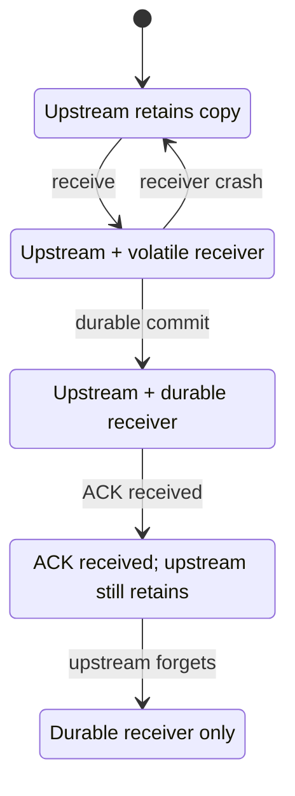

# Delivery ownership

## Purpose and provenance

This page connects the Stage 4 **target contract** to the Stage 5 local implementation. The default [Rust demo](../../src/main.rs) still prints volatile batches. The optional `write` path uses [EventLog](../../src/log.rs) to establish a local durable commit before printing `committed event N`. No network ACK or general upstream sender exists.

The question is when a sender may discard its retryable copy. [ADR-0005](../decisions/ADR-0005-ack-after-durable-commit.md) chooses the rule: the sender may forget an event only after it receives an acknowledgement that follows a durable receiver commit. Here, successful `append(&Event)` is the receiver-side commit, and the CLI's commit line is a local observation after success.

## One-event path

<!-- diagram: ../diagrams/state-machines.mmd -->

The diagram shows the primary path for one event in the target protocol. The [TLA+ model](../../formal/delivery/DeliveryOwnership.tla) also allows a retry after a receiver crash or lost acknowledgement. In the model, an ACK is an acknowledgement *received by the sender*; a missing or lost ACK leaves the sender's copy in place. The local CLI has no network step corresponding to ACK delivery.

## Alpha network path (phase 2, in progress)

Implemented: `fabric-node run` sends the oldest unacknowledged spool batch, as its exact stored bytes, to the [Fabric Server](../../crates/fabric-server/src/lib.rs) over HTTPS with a bearer token. The server's single commit thread applies the [ADR-0013](../decisions/ADR-0013-deliver-batches-in-order-with-bounded-dedup.md) rule, appends new batches to its own [frame log](../../crates/fabric-frame/src/frame.rs) as one grouped frame (50 ms or 1 MiB), and answers only after that frame's data and marker syncs. The node then writes its ACK cursor by synced rename and may delete sealed spool files at or below it. A lost ACK is a retry of the same identity and bytes, which the server acknowledges again without a second record. The same identity with different bytes is refused and never replaces the committed batch. A credential label binds to one node identity on its first commit.

[Fault runs](../experiments/formal/alpha-phase2-delivery-faults.md) graded by the [delivery oracle](../../tools/qualification/DELIVERY_ORACLE.md) pass for three nodes under server kills, node kills and an outage. Not yet established: ten real node processes, ACK latency, and the grouped-versus-individual comparison. The [phase ledger](../ALPHA.md#phase-ledger) records their status.

## Model-to-code mapping

| Model action | Current Rust counterpart | Limit |
| --- | --- | --- |
| `Receive` | `EventBuffer::try_push` places an owned event in volatile memory | The generator and buffer share one process. |
| `Commit` | `EventLog::append(&Event)` syncs an event frame, then writes and syncs its commit marker | Assumes a filesystem that honors successful sync and a synced parent directory entry. |
| `Acknowledge` | `write` prints `committed event N` only after append succeeds | This is local output, not a transmitted ACK. |
| `Forget` | The command drops the event after successful append | On error it exits; manual rerun reconstructs the synthetic source from the same seed/count. |
| `ReceiverCrash` | Separate `write` and `replay` process invocations, plus simulated torn tails in tests | Abrupt power loss is not exercised. |

The CLI compares recovered events against the full deterministic generator prefix. That gives this particular source a retry path after ordinary process termination, provided no storage I/O error occurred. A failed marker sync can leave a visible marker without a reliable durable copy; this file cannot reveal the earlier error on reopen. After such an error, rebuild from an independent source on healthy storage. Arbitrary senders still need stable identity, retained upstream data, and a duplicate policy.

## Safety boundary

The two checked invariants are:

1. Every acknowledged event is in the durable set.
2. Every modeled event is still held upstream or is in the durable set.

An in-memory queue does not count as durable. For this local log, successful file sync establishes the implementation's commit boundary under its filesystem assumptions, including durable ancestor path names and no unresolved storage sync error. The model assumes stable distinct event identities, a retry path, and a durable record that is not lost after commit. The synthetic CLI supplies a repeatable sequence only when invoked again with the same settings and locked generator version; `EventId` does not establish global uniqueness.

## Failure behavior and limits

Before commit, a receiver crash clears its volatile copy while the sender retains its copy for retry. After commit, a crash leaves the durable copy. If an ACK is lost, the sender may retry; a general implementation must decide how duplicate deliveries are recognized. Sender crashes and loss of the upstream copy are outside this model; it assumes that copy remains available until `Forget`. No fairness assumption forces an ACK to arrive, so the model makes no eventual-progress claim.

The [formal investigation](../experiments/formal/delivery-ownership.md) records the finite TLC check and an early-ACK counterexample. It does not verify Rust, fsync, filesystem recovery, network behavior, or a byte-level memory bound. The [Stage 5 implementation checks](../experiments/formal/delivery-rust-stage5.md) exercise restart and torn-tail recovery under a live operating system; they still cannot prove physical power-loss durability. See the [storage view](storage.md) for the format and failure assumptions.

The [Homa/SIRD transport study](../experiments/ablation/receiver-driven-transport.md) investigates receiver GRANT/CREDIT scheduling for a future network boundary. Its [network-limited H1](../experiments/ablation/receiver-credit-h1-run-01.md) and [M2 prefix](../experiments/ablation/unscheduled-prefix-m2-run-01.md) simulations, plus the [finite transport model](../experiments/formal/transport-credit-ownership.md), keep CREDIT separate from the modeled post-commit durable ACK. Those results do not implement a network sender or prove durability in this Rust application.
