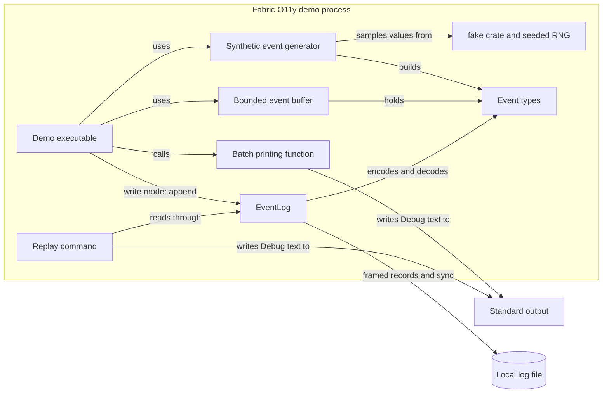

# FOL2 demonstration

This page describes the original single-process demonstration: typed events, a seeded generator, a bounded buffer and the FOL2 local log. It is a supported legacy path and a learning artifact, not the product. The product architecture is in the [system view](system.md).

## Purpose and boundaries

The original demo demonstrates a typed claim about a resource, repeatable synthetic input, a bounded local queue, and an optional local append-only log. It remains a Rust executable with a library target in the same package. The same package also builds the Spindle binaries described in the [Spindle view](spindle.md). The event types, generator, buffer, and FOL2 log remain the demo path. There are no network listeners or deployment manifests. A separate [packet-slot simulator](../../tools/transport-sim/README.md) is research tooling outside this application boundary; it currently has H1 and one-packet M2 cells.

| Boundary | Responsibility | Repository evidence |
| --- | --- | --- |
| Event types in the library | Describe event identity, time, context, and payload | [src/lib.rs](../../src/lib.rs) |
| Synthetic event generator | Use `fake` and a seeded ChaCha8 RNG for values; assign Fabric IDs and times; yield owned Gauge events | [src/generator.rs](../../src/generator.rs) |
| Bounded event buffer | Accept events up to a positive logical capacity, return full-buffer rejections, and drain FIFO batches | [src/buffer.rs](../../src/buffer.rs) |
| Local event log | Encode, frame, sync event and marker, recover, and stream stored events with one advisory writer lock | [src/log.rs](../../src/log.rs) |
| Executable | Default print demo; optional `write` and `replay` commands | [src/main.rs](../../src/main.rs) |
| Rust standard output | Receive the formatted debug text | `println!` in [src/main.rs](../../src/main.rs) |
| Local file | Hold versioned framed records after a successful sync | [storage view](storage.md) |
| Package | A Cargo workspace ([ADR-0012](../decisions/ADR-0012-add-a-server-crate-in-a-workspace.md)). The root package builds the library, demo and node binaries with `fake`, `crc32fast`, pinned `opentelemetry-proto`/`prost`, `libc`, and a synchronous `ureq`/`rustls` client. `crates/fabric-server` adds tokio, axum and rustls. Research packages under `tools/` stay outside the workspace | [Cargo.toml](../../Cargo.toml), [Cargo.lock](../../Cargo.lock) |

<!-- diagram: ../diagrams/fol2-demo.mmd -->

The canonical source is [fol2-demo.mmd](../diagrams/fol2-demo.mmd). The diagram's domain node is a type boundary, not a separately running service.

## Execution and ownership

A separate [storage/query probe](../../tools/storage-probe/README.md) depends on the library. It replays experiment-owned logs into immutable snapshots and compares exact scans with optional summaries. It is not called by the application CLI, and its in-memory query boundary is shown in the [S1 research projection](../experiments/ablation/storage-query-s1-run-01.md). The [query research view](query.md) describes the separate coverage experiment and its trusted-builder/anchor boundary. The [storage research agenda](../experiments/ablation/observability-storage-research.md) links that original cell to the implemented [local research lifecycle](research-prototype.md) and the separately measured columnar comparison.

1. `main` accepts no arguments (seed `42`, count `3`), a `u64` seed and `u32` count, `write <PATH> <SEED> <EVENTS>`, or `replay <PATH>`. Invalid argument shape or numeric values produce a usage message and status `2`; log I/O or workload-prefix mismatches return failure status `1`.
2. `main` iterates `EventGenerator`, which creates one owned synthetic `Gauge` event per call to `next`.
3. `main` calls `EventBuffer::try_push`. A successful call transfers ownership to the buffer. A full buffer returns the same event to `main` and keeps existing queue contents unchanged.
4. On rejection, `main` drains a batch of at most two oldest events, processes it, then retries the returned event. After the generator ends, it drains the remainder. Default mode prints each batch; those events are then dropped without a durable owner.
5. `write` mode opens and validates an [EventLog](../../src/log.rs), compares recovered events with its deterministic generator prefix, then appends the remaining events. `append` borrows each event, syncs its frame, then writes and syncs a commit marker. Only after both syncs does the command print `committed event N` and release the value. `replay` opens the file, removes an unmarked tail if present, and prints committed events in order.

The executable reads only command-line settings and samples no clock. The apparent telemetry is synthetic, not an observation collected from a live service. Debug output has no stable serialization or protocol contract. Printing and per-record sync make the commands unsuitable as throughput benchmarks; the [earlier generator and batch-size probe](../experiments/benchmarks/generator-library-stage3.md) omits output and storage during timing.

## Enforced properties and limits

- Rust distinguishes `EventId`, `TenantId`, `SourceId`, and `ResourceId`; a value of one type cannot be passed as another without explicit construction or conversion. All currently wrap `u64`.
- `EventTime` and `ObservedTime` are distinct `i64` wrappers documented as Unix nanoseconds. The code does not check units, clock relationships, or ordering.
- A `Payload` is exactly one of `Log` or `Gauge`. It carries its variant, so there is no separate signal tag to keep synchronized.
- Fields and tuple constructors are public. The generator assigns sequential IDs within one sequence, but other callers may reuse them. Attributes may repeat keys, strings may be empty, and floating-point values may be non-finite when constructed outside the generator.
- A config with seed and count yields the same sequence with the locked dependency versions. The [tests](../../tests/generator.rs) pin seed `42` and check replay, seed variation, zero count, prefix stability, and streaming of a large count. This fixed synthetic workload has not been measured against production traffic.
- The buffer has positive capacity and never accepts an event when full. It drains oldest events first. The [buffer tests](../../tests/buffer.rs) check rejection, retry, order, and logical occupancy. Event byte size and `VecDeque` allocation overhead are not bounded by a fixed byte budget.
- Buffer acceptance means only temporary in-memory ownership. `EventLog::append(&Event)` provides a local commit after syncing the event frame and its commit marker; it does not consume the caller's event on error. Open scans committed pairs, removes an unmarked tail with a plausible partial header or marker, and refuses detected malformed checked fields or complete payloads. The [storage view](storage.md) states the filesystem assumptions and remaining failure modes.
- There is no network ACK or general upstream sender. The CLI's repeatable seed/count reconstructs an upstream sequence on ordinary manual restart and verifies it against the stored prefix. It cannot infer a previous storage sync failure from the file, so the operator must rebuild from an independent trusted source instead of rerunning against that path after one. The broader TLA+ sender-retention guarantee is not implemented for arbitrary callers, and `EventId` is not globally unique. No power-loss test or general throughput guarantee has been established; the [Stage 6 baseline](../experiments/benchmarks/local-log-stage6.md) measures one synthetic local workload.

## Design provenance

[ADR-0001](../decisions/ADR-0001-keep-domain-independent.md) records the separation between event meaning and infrastructure mechanisms. [ADR-0002](../decisions/ADR-0002-reject-full-buffer.md) records the full-buffer ownership rule. [ADR-0004](../decisions/ADR-0004-use-fake-for-synthetic-values.md) records the generator library choice. [ADR-0005](../decisions/ADR-0005-ack-after-durable-commit.md) sets the delivery rule, and [ADR-0006](../decisions/ADR-0006-use-framed-local-log.md) records the first local storage format. The [input view](ingestion.md) and [storage view](storage.md) trace their current boundaries separately.

The [blueprint](../architecture.md) sketches mostly `u128` IDs, schema and signal fields, more scalar types, and additional signals. Those are proposals. The current implementation is smaller; the repository contains no experiment selecting `u64` over `u128`. This documentation records the discrepancy without changing either design or code.

## Open questions

The [S0 attribution](../experiments/benchmarks/append-attribution-s0.md) now separates encoding, writes and syncs inside `EventLog::append`, with an 11.017% perturbation flag. The [learning path](../LEARNING_PATH.md) keeps the completed local research prototype separate from future application services. Workload representativeness, identities across multiple generators, a general retry/deduplication rule, a byte-level memory budget, and performance targets remain open. The [generator library ablation](../experiments/benchmarks/generator-library-stage3.md) is an exploratory measurement, not a performance recommendation. A deployment view becomes useful when processes become independently deployed services; the research CLI currently runs sequential local processes.
