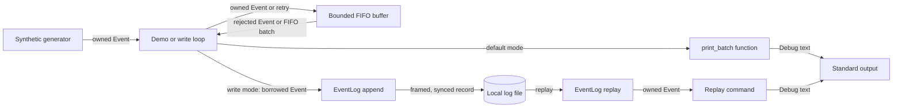
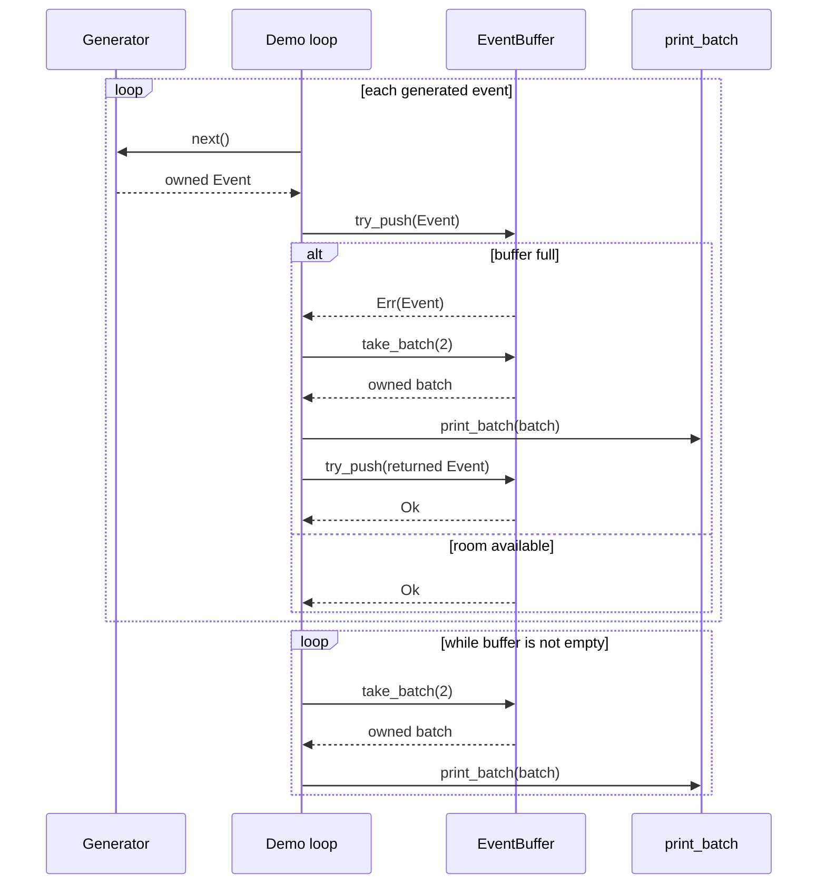

# Local input and batching

## Purpose and boundaries

The current input is the [synthetic generator](../../src/generator.rs); there is no network collector. The [buffer](../../src/buffer.rs) holds events in one process and one thread. The [executable](../../src/main.rs) drives both the producer and consumer: default mode prints drained batches, while `write` mode commits them through [EventLog](../../src/log.rs). These are separate code roles, not separate services.

## Data flow

<!-- diagram: ../diagrams/data-flow.mmd -->

The diagram follows ownership of event values. `print_batch` is a function called by the default demo; it is not an independent worker. The `write` path borrows each drained event for append and prints a commit line only after sync succeeds. `replay` decodes stored events for inspection. Debug text is not a query format.

## Control flow at capacity

<!-- diagram: ../diagrams/control-flow.mmd -->

Both default and `write` modes use capacity `2` and batch size `2`, so a third event demonstrates a full-buffer return. The API accepts any positive capacity and batch limit through `NonZeroUsize`. A returned `Err(event)` leaves the buffer unchanged; the caller still owns the event. Taking a batch removes up to the limit, oldest first, and transfers ownership to the caller. A final batch may be short.

## Invariants and failure behavior

For capacity `C > 0`, successful push requires `len < C`, rejection does not change `len`, and batch removal decreases `len`; therefore logical occupancy remains between `0` and `C`. The demo drains a nonempty batch when full, so its retry has room. [ADR-0002](../decisions/ADR-0002-reject-full-buffer.md) states the assumptions and alternatives.

These are in-memory rules. A caller can discard a rejected event, and an event printed to standard output has no durable owner. The optional [local log](storage.md) adds a commit boundary after the buffer; [delivery ownership](delivery.md) explains how that corresponds to the modeled `Commit`. The [current batch-size measurements](../experiments/benchmarks/generator-library-stage3.md) used the pre-storage pipeline and do not establish a representative throughput target.

See the [buffer concept](../concepts/buffer.md), [buffer tests](../../tests/buffer.rs), and [current project state](../CURRENT.md).
