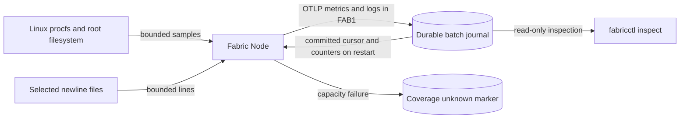

# Native Linux node: phase-1 contract

Status: local collector, inspect, source/fault controls and [three earlier native measurement trials](../experiments/benchmarks/alpha-phase1-native-run-01.md) exist. Four focused [cross-family review repairs](../experiments/formal/alpha-phase1-review-checkpoint.md) pass local probes; final parent review and qualification decision remain pending. The node uses one process and a small synchronous loop; no watcher, plug-in, privileged helper or network path is part of this phase.

<!-- diagram: ../diagrams/alpha-node.mmd -->

The canonical source is [alpha-node.mmd](../diagrams/alpha-node.mmd). These paths are local; there is no server or network delivery in this diagram.

The Rust ownership rule is simple: a source read builds an owned candidate `Batch`; the node does not advance its in-memory cursor or forget source responsibility until `Journal::append` returns its committed batch after data and marker sync. On restart it reconstructs cursors and counter start information by streaming committed batches. The tradeoff is a linear replay of at most the configured spool cap and a stopped collector when its byte cap is exhausted. The spool keeps an ACK cursor and deletes whole sealed files at or below it ([storage view](storage.md)); without a server the cursor stays at zero and every batch is kept.

Supported telemetry profile: bounded OTLP protobuf export requests inside `FAB1`. Host resource attributes identify hostname and Linux boot ID. `/proc/stat` supplies aggregate CPU user/system/idle cumulative time in seconds (kernel clock ticks converted with `sysconf`); `/proc/meminfo` supplies total and available byte gauges; `statvfs("/")` supplies root filesystem capacity/available byte gauges; `/proc/diskstats` supplies cumulative read/write bytes per named device (512-byte sectors); `/proc/net/dev` supplies cumulative received/transmitted bytes per named interface. Counter points use cumulative monotonic Sum, observation time, and a start time that changes on detected decrease or boot ID change. Gauges carry observation time and units. Disk and interface cardinality are capped with explicit source failure; no implicit device filtering is claimed. No rate is fabricated from a Gauge.

Selected UTF-8 newline files produce OTLP LogRecords with observed time, source path and byte offsets. The file has no intrinsic event timestamp, so event time remains unknown. A committed cursor identifies path, device, inode, byte offset, a CRC32 witness of up to 64 consumed prefix bytes, and whether it is skipping an oversized line. The skip bit lets a 256 KiB bounded scan advance across a longer line over several cycles and restarts; only bytes after its newline can become a new record. On a new inode, shorter file or changed witnessed prefix, the node reports unknown prior coverage and starts the file from byte zero. It leaves incomplete normal lines uncommitted, marks overlong or invalid UTF-8 lines as gaps, and never slurps a whole file into memory. It opens selected paths nonblocking and rejects nonregular files promptly, so an unwritten FIFO cannot stall collection. A source permission or parsing failure is explicit. The collector permits at most 16 configured log paths, 64 disk devices, 64 network interfaces, 4 KiB per line, 128 lines and 256 KiB scanned per file per pass, and 64 KiB of log bodies per cycle across all files. Files are visited in path order starting at a different file each batch, so one busy file cannot starve another. At the default 15 s interval that caps collection near 4.3 KiB/s of log bodies per node; the registered workload offers 1 KiB/s. Unread bytes after each cycle are printed as `log_backlog_bytes`, and `fabricctl inspect` reports the same count from the last committed cursors, so lag is visible rather than silent. Eight gaps per log, one host failure and one coverage-unknown notice give a fixed worst case of 130 gaps in one batch; all configured sources are still visited, with later valid lines read from their saved cursors. These are local profile limits, not a general OTLP receiver. The [independent reader review](../experiments/formal/alpha-log-reader-repair.md) preserves the original counterexamples and repaired probes.

The prefix witness detects an ordinary same-inode replacement whose first witnessed bytes differ, including a truncate and regrow past the old offset. Identical witnessed prefixes, CRC32 collisions and changes outside the witnessed bytes can still be missed. Collection gaps report observed source failures, not a proof that the source never changed between observations.

`fabric-node` takes one local config path for `collect` (one cycle) or `run` (repeated cycles at interval boundaries). In `run`, SIGTERM or SIGINT ends the loop after the current cycle. If a cycle cannot commit, the node writes a `coverage-unknown` marker holding the attempt time; the next committed batch carries one `coverage unknown since <ns>` gap and the marker is then removed. A full spool keeps failing until space exists, so the notice appears only once a later batch commits. The only config values are a spool path, selected log paths, metric interval and spool byte ceiling. File-loaded and directly constructed configs use the same validation and log-path normalization before opening a spool. `fabricctl inspect` reads the same config to report journal identity, committed batch/metric/log counts, OTLP payload bytes, used bytes and coverage status. Inspection is read-only and can see an incomplete suffix during a concurrent append; it does not repair the journal. An in-progress marker under a live writer lock makes inspection retryable. A dead writer's in-progress marker reports `interrupted_append=true` with the counts reopen will keep. A recorded `recovery-required` reports that status and file size, with no records counted as committed. A marker appearing during a scan makes inspection retryable. Counter history holds only the latest complete sampled series, and restart replay holds cursors only for currently configured paths, so obsolete boots/devices and removed log sources do not accumulate in memory. There is no remote configuration or control API until later phases. [Alpha gates](../ALPHA.md#phase-ledger) and [storage](storage.md) set the durable and qualification boundaries.
