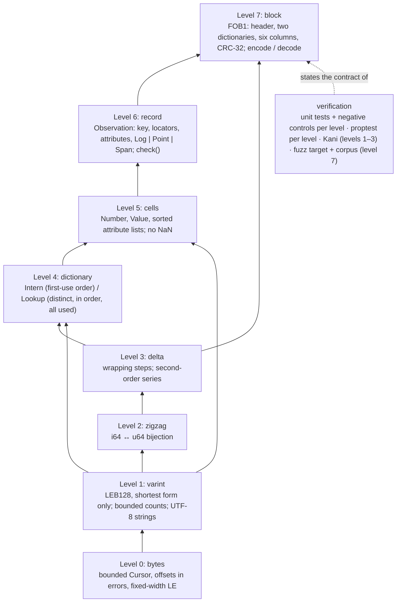

# Observation record and FOB1 encoding

Status: **proposed** ([ADR-0023](../decisions/ADR-0023-define-an-observation-record-with-a-canonical-encoding.md)). The crate [fabric-observation](../../crates/fabric-observation/src/lib.rs) exists, is tested, fuzzed and measured, and is wired to nothing: no Spindle emits it, no journal or Segment stores it. This page describes what it is and how it is built, so that the decision to adopt it can be read against the code.

## Purpose

One record type for the three signals Fabric may ever store, under the key the query kernel already orders by, with the same trace locators and the same typed attributes on every kind, and one **canonical** byte encoding: a valid block of records has exactly one byte string, and an accepted byte string decodes to exactly one block whose re-encoding is the same bytes. A hash of such bytes is a hash of the records. That is what the [storage direction](../research/storage-direction.md) needs to store the payload once: today the node's OTLP bytes are not canonical, so the server can only vouch for the bytes it received, and keeps them beside the queryable projection.

## The tower

The crate is eight modules, each a level with its own contract, unit tests and negative controls, and each using only the levels below. The canonical property is proved or tested per level and composes upward.



The canonical source is [observation-tower.mmd](../diagrams/observation-tower.mmd).

| Level | Module | Contract | What it refuses | Checked by |
| --- | --- | --- | --- | --- |
| 0 | [bytes](../../crates/fabric-observation/src/bytes.rs) | every read is total and exact; an error names the offset of the field that failed; a write is the inverse of its read | reading past the end | unit tests |
| 1 | [varint](../../crates/fabric-observation/src/varint.rs) | one byte string per `u64`, the shortest LEB128; counts bounded by the bytes left; strings UTF-8 | overlong forms, more than ten bytes, overflow, counts that could not fit, invalid UTF-8 | unit tests; properties `varint_round_trips_in_its_declared_length`, `varint_accepts_only_the_shortest_form`; Kani `level1_varint_round_trips_every_u64` |
| 2 | [zigzag](../../crates/fabric-observation/src/zigzag.rs) | a bijection `i64 ↔ u64` with small magnitudes mapped to small codes | nothing (total) | unit tests; property; Kani for every value |
| 3 | [delta](../../crates/fabric-observation/src/delta.rs) | `step`/`unstep` invert for every pair under wrapping arithmetic; a regular series codes to zeros after its second element | nothing (total) | unit tests; properties; Kani for every pair |
| 4 | [dictionary](../../crates/fabric-observation/src/dictionary.rs) | a table in first-use order with distinct entries, all used | an id referenced before its turn, a repeated entry, an unused entry | unit tests; properties; [CX-FOB1-DUPLICATE-DICTIONARY](../formal/counterexamples.json) |
| 5 | [cells](../../crates/fabric-observation/src/cells.rs) | numbers and attribute values with one byte form each; attribute lists strictly sorted by key | NaN, unsorted or duplicate keys, unknown tags | unit tests |
| 6 | [record](../../crates/fabric-observation/src/record.rs) | the Observation type and `check`, the rules a record meets to have an encoding | severity above 24 and the cell rules | unit negative controls |
| 7 | [block](../../crates/fabric-observation/src/block.rs) | FOB1: the layout below; `decode(encode(b)) == b`, `encode(decode(x)) == x` | reserved tag bits, trailing bytes, CRC mismatch, every lower level's refusal | unit tests with mutation controls; properties `round_trip_is_identity`, `mutations_are_rejected_or_canonical`, `arbitrary_bytes_never_panic`; fuzz target `observation_block` |

## The record

| Field | Meaning |
| --- | --- |
| `strand` | `(node_id: [u8; 16], generation: u64)`, the Strand |
| `sequence`, `index` | the producer's Batch sequence and the record's position in it |
| `time_ns` | the node's time: observed time of a line, point time, start of a span |
| `locators` | optional `trace_id` (16 B), `span_id` (8 B), `parent_span_id` (8 B): the same on every kind, so a line, a point and a span join by equality |
| `attributes` | `Vec<(String, Value)>`, strictly sorted by key; `Value` is `Str`, `Int`, `Double` (by bits), `Bool` or `Bytes` |
| `signal` | `Log { severity 0..=24, event, body }`, `Point { name, unit, Gauge \| Sum { monotonic, start_ns }, Int \| Double }`, or `Span { name, end_ns, status, kind }` |

The total order is `(time_ns, node_id, sequence, index)`, the [query kernel's](../../crates/fabric-core/src/query.rs) `RowKey`; nothing new is asked of the kernel.

## The block

```text
"FOB1"
varint record count                                  (1 to 65,536)
varint node count, then 16-byte node ids             dictionary, first-use order
varint string count, then length-prefixed strings    dictionary, first-use order
column 1  times:      first value, then second-order delta codes
column 2  strands:    per record  node id, Δgeneration, Δsequence, Δindex
column 3  tags:       per record  one byte: kind (2 bits), has locators, has parent
column 4  locators:   per flagged record  trace id, span id, [parent span id]
column 5  attributes: per record  count, then (key id, value tag, value)
column 6  payloads:   per record  the signal's cells
CRC-32 (IEEE) of everything above, little-endian
```

Columns rather than rows, so that each column uses the level that fits it and a general compressor sees runs of like values; one block per file or per Batch, as the producer chooses. Measured in [observation encoding run 01](../experiments/benchmarks/observation-encoding-run-01.md): on real log text 14.5 bytes per record under Zstd against 18.2 for the raw OTLP Batches, the same within 1 % on the synthetic workload; under a microsecond per record to encode and half that to decode.

## What is not decided

Adopting the record anywhere is a separate decision: on the wire it is a new Batch payload slot or envelope version ([scope rule](../../AGENTS.md#scope-rule)); in a Segment it is a manifest version and a reader that keeps reading version 1 ([ADR-0020](../decisions/ADR-0020-store-sealed-history-as-parquet-segments.md)); a traces signal is a [product contract](../PRODUCT-CONTRACT.md) change. The Kani harnesses compile under `cfg(kani)` but are not in the registered `kani-core` check until that policy is extended in its own commit.
