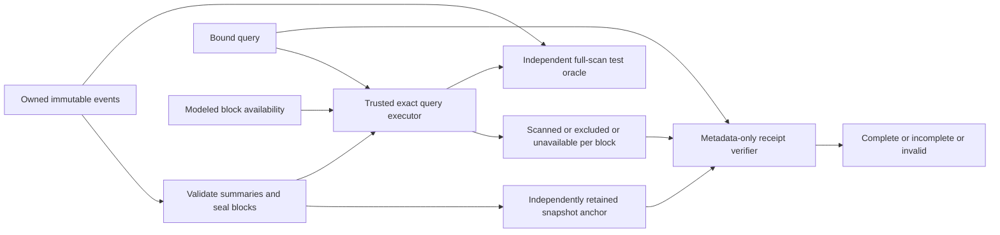

# Query research boundary

## Purpose and components

The application has no query service. The separate [storage probe](../../tools/storage-probe/README.md)
contains S1's in-memory scan/Bloom comparison, E1R's [coverage protocol](../experiments/ablation/coverage-e1-protocol.md), and a local disk query/resume CLI. The [layout probe](../../tools/layout-probe/README.md) compares Parquet projection and optional postings. Neither changes the application CLI or FOL2.

S1 owns rows and optional summaries together. E1R separates a trusted builder and
scan executor from a verifier that receives only metadata. The builder owns immutable
rows, validates exact tenant/token sets and time bounds, and computes SHA-256 block
commitments and a snapshot anchor. The caller supplies that independently retained
anchor to verification; a root received with a query response is not independently trusted.

<!-- diagram: ../diagrams/coverage-research.mmd -->

## Data flow and failure behavior

The research query predicate is inclusive event time, optional exact tenant and optional
case-sensitive whitespace token in Log bodies. Results are original row positions;
repeated EventIds remain distinct. Every block receives a scanned, excluded or unavailable
disposition, with authenticated metadata. An excluded disposition carries the summary so
verification can check both its digest and whether it actually excludes the query.

Verification returns `Complete`, `Incomplete { unavailable }`, or an error. Missing
ordinals, inconsistent counts/ranges, wrong snapshot/query bindings and malformed proofs
are errors. An explicit unavailable candidate makes a valid receipt incomplete. Missing
raw rows may still be safely excluded using validated authenticated metadata: this is a
query-completeness claim about the immutable snapshot, **not proof of retained raw data**.
Retention auditing is a separate, unimplemented question.

## Invariants and limits

- A private sealed snapshot cannot change rows after summary validation.
- Supplied summaries may overapproximate, but must cover every row time, tenant and token.
- Commitments bind full Event contents, including float bits and attribute order.
- Receipt verification has no row slice, storage handle or row-loading callback.
- Contiguous authenticated block ranges cover the trusted row count exactly.
- A complete receipt has no unavailable candidate blocks.
- The trusted exact executor remains responsible for scanned results. A marker is not a proof of execution.
- An incorrect summary can be authentically sealed by a faulty builder. The negative control demonstrates why the builder is a separate trust assumption.

E1R itself is an in-memory correctness cell. The later [research lifecycle](research-prototype.md) persists JSON blocks, an external Publication and checkpoint history, and uses E3 residual merge. Availability remains a caller mask plus local file checks, not detected physical loss. This does not establish a malicious-server proof, compaction, or a performance winner.

## Decisions and evidence

[ADR-0007](../decisions/ADR-0007-experiment-with-coverage-receipts.md) records the experimental
choice and its conditional partition argument. The [fixed API](../../tools/storage-probe/COVERAGE_API.md)
separates the builder, commitment utility, query executor and verifier. The [E1R result](../experiments/ablation/coverage-e1-run-01.md) preserves the independent positional oracle, fault injections and cross-family reviews; its finite corpus cannot establish an unbounded guarantee. [S1's measured result](../experiments/ablation/storage-query-s1-run-01.md)
remains a separate logical-pruning result.

The external anchor lifecycle and persisted retry are implemented in the research probe and have their own [S2 evidence](../experiments/ablation/durable-snapshot-s2-run-01.md). The [E3 finite corpus](../experiments/ablation/resume-e3-run-01.md) passed for selected candidate B under its stated trust assumptions. Registered [receipt/resume costs](../experiments/benchmarks/research-costs-run-01.md) are measured, including substantial overhead on cheap predicates.
