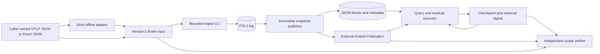

# Local research prototype

The separate [storage probe](../../tools/storage-probe/README.md) now has a runnable local lifecycle. It does not change the application's default CLI, FOL2 format, or service boundary. The [layout probe](../../tools/layout-probe/README.md) is a separate Arrow/Parquet comparison library; it is not the lifecycle's published format.

<!-- diagram: ../diagrams/research-prototype.mmd -->

## Boundaries and contracts

`adapt-otlp` accepts only the [registered bounded offline Logs profile](../../tools/storage-probe/COLLECT_API.md), maps ordered scalar attributes into `Event`, and writes a fresh version-1 input file. It is neither a network OTLP receiver nor a general OTLP implementation. `ingest` decodes the whole capped input, checks any existing FOL2 file as an exact bit-preserving prefix, then feeds the missing suffix through `EventBuffer`. A full buffer returns ownership for retry. Each borrowed `EventLog::append` commits under the application's filesystem assumptions; an I/O error requires a trusted independent source and healthy storage before rebuilding that path.

`publish` replays FOL2 and writes fresh immutable JSON blocks and authenticated metadata. It returns an anchor in a `Publication` retained outside the snapshot directory. The caller must keep this root independently: metadata inside a snapshot cannot authorize itself. Query binds that root, the exact predicate, and tokenizer/order versions. Every block is either scanned after raw authentication, safely excluded by authenticated metadata, or unavailable. A cold-directory copy may substitute for a missing hot file; missing or corrupt candidates leave the answer incomplete, even under an all-available mask. Safe exclusions establish answer coverage without proving raw retention.

Resume loads a checkpoint against a separately retained SHA-256 digest, validates its page history through `Accumulator`, and asks the disk snapshot only for the root-bound residual. It writes a new checkpoint without replacing the old one. Wrong query, root, version, digest, or history fails. A late event belongs to a new snapshot and cannot be merged into an old checkpoint. `verify` rebuilds the expected root from independent input and compares a complete answer to a separate scalar predicate. Manifest rebuild is limited to raw copies that reproduce the **same** trusted root; it cannot mint a replacement root or always recover from a corrupt preferred copy. See the exact [disk](../../tools/storage-probe/DISK_API.md), [resume](../../tools/storage-probe/RESUME_API.md), and [CLI](../../tools/storage-probe/CLI_API.md) contracts.

The [S2 correctness result](../experiments/ablation/durable-snapshot-s2-run-01.md) covers disk publication, restart, injected read failures and fail-closed behavior. The [end-to-end contract](../experiments/ablation/end-to-end-prototype.md) records completed E3 and cost gates. The local demo ran separate processes, but its single timing is not a benchmark. The [S3/S4 layout](../../tools/layout-probe/API.md) duplicates raw Events with projected fields and authenticates the whole Parquet file on every query; [measured costs](../experiments/benchmarks/research-costs-run-01.md) favor compression on the registered synthetic inputs, while JSON remains the local lifecycle baseline.

The [integrated run](../experiments/ablation/local-prototype-run-01.md) preserves the
collection/CLI counterexamples and replay commands. [ADR-0009](../decisions/ADR-0009-isolate-durable-research-snapshots.md)
records the separate snapshot publication and checkpoint boundary.
