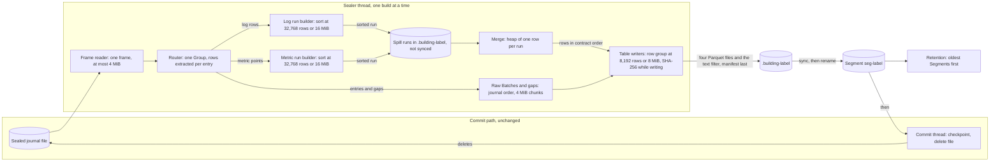
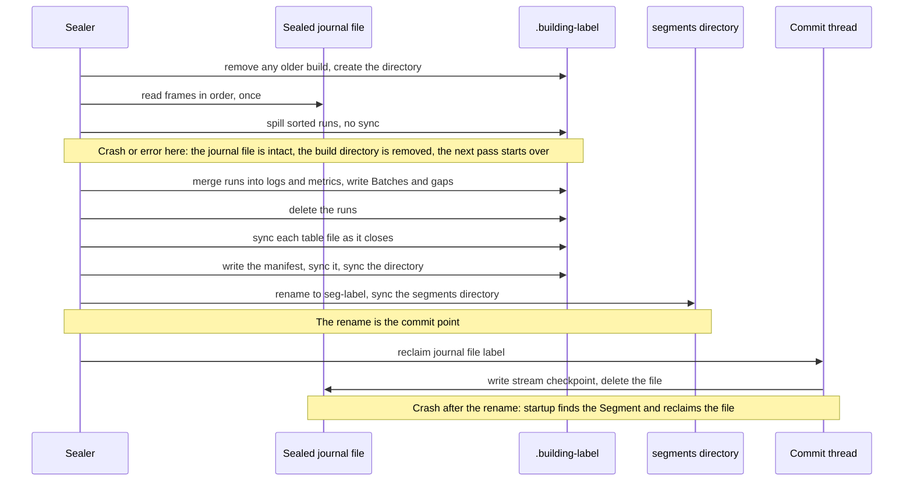

# Sealer

**Status: accepted design, not yet implemented** ([ADR-0022](../decisions/ADR-0022-build-segments-by-external-merge-sort.md)). Today's sealer builds each Segment in memory; [Current behavior](#current-behavior) says how. Nothing below is **Implemented** or **Tested** in the [evidence-state](../QUALIFICATION.md#evidence-states) sense until the [bounded-sealer milestone](../milestones/bounded-sealer.md) records its commands and exits. The design changes no persisted format and no query answer.

The sealer is part of [retained history](retained-history.md). It runs after ingestion has finished with a record: the [delivery](delivery.md) path has already synced the Batch to the journal and sent the ACK. The sealer never delays an ACK directly. It shares CPUs and the disk with the commit thread, and the journal cannot shrink until it finishes.

## The five questions

1. **What does it receive and produce?** It receives one sealed server journal file, `sealed-<label>.faj`, a frame log of Groups of Batches. It produces one Segment, `segments/seg-<label>`: four Zstd Parquet files and a manifest ([ADR-0020](../decisions/ADR-0020-store-sealed-history-as-parquet-segments.md)).
2. **What promise does it make?** A query over the Segment returns what a query over the journal file would, with the same rows in the same order. A Segment is visible only when complete.
3. **Who owns the data before and after?** The journal file belongs to the journal until the Segment's rename commits. Then the commit thread checkpoints stream state and deletes the file. Until the rename, nothing the sealer does can lose a record.
4. **What can fail, and how is it visible?** A read error, a corrupt frame, a full disk or a crash. The build directory is removed, the journal file stays, and the error is logged on every pass until a retry succeeds ([failure states](#failure-states)).
5. **What would prove the design wrong?** A Segment that answers differently from today's, a peak heap that grows with the file, or a spill file left behind ([Validation in the ADR](../decisions/ADR-0022-build-segments-by-external-merge-sort.md#validation)).

## Architecture

<!-- diagram: ../diagrams/sealer.mmd -->


Reading the diagram: rows for the two sorted tables (logs and metrics) take the long road through sorted runs on disk and a merge. The raw Batches and the gaps keep journal order, so they go straight to their writers. Everything is a stream except the two run builders, and those are capped.

The code stays in `fabric-server`, which is a composition root that holds its adapters ([system view](system.md#layers)). External sorting is a mechanism, not domain meaning: the order it must produce is already the contract's, and the retention decision stays in `fabric-core`. The design adds no crate, no dependency, no port and no configuration key.

## The algorithm

For one sealed file with label `L`:

```text
create .building-L                       (removing any older one)
for each frame in the file, in order:    one frame in memory, at most 4 MiB
    group = decode(frame)
    for each entry in group:
        batches_chunk.push(group_sequence, entry)        4 MiB cap, then written
        rows = extract(group_sequence, entry)
        gaps_writer.write(rows.gaps)
        for each log row:    log_run.push(row)           32,768 rows or 16 MiB
        for each metric:     metric_run.push(point)      32,768 rows or 16 MiB
        when a run is full:  sort it by key, spill it as a run file
    update the manifest totals (first and last group, record count,
        receive-time bounds, newest time per node)
spill the last partial run of each table
for each of logs, metrics:
    heap = one row from the front of each run
    while heap is not empty:
        row = heap.pop_min()
        group_buffer.push(row)
        if the buffer holds 8,192 rows or 8 MiB: write it as one row group
        heap.push(next row of the same run)
    delete the runs
close the four writers (sync each file), write and sync the manifest,
sync the directory, rename to seg-L, sync the segments directory
```

The key is `(time, node identity, sequence, index)`, where time is `observed_ns` for logs and `time_ns` for metric points. It is unique for every row, so the merged order does not depend on how rows fell into runs.

### A worked example

Ten rows arrive with these times, and a run holds four rows:

| Step | Runs on disk | Memory |
| --- | --- | --- |
| rows 7 2 9 4 arrive | none | the four rows; full, so sort and spill |
| spilled | run 1: 2 4 7 9 | none |
| rows 1 8 3 6 arrive | run 1 | four rows; full, so sort and spill |
| spilled | run 1; run 2: 1 3 6 8 | none |
| rows 5 0 arrive, file ends | runs 1, 2 | two rows; spill as the last run |
| merge begins | run 1: 2 4 7 9; run 2: 1 3 6 8; run 3: 0 5 | the heads 2, 1 and 0 |
| merge pops 0, 1, 2, 3 | runs shrink as heads advance | three heads and a row group of four, which is written |
| merge pops 4 5 6 7, then 8 9 | all runs empty | row groups `[4 5 6 7]` and `[8 9]` |

The output is `0 1 2 3 4 5 6 7 8 9`, in three row groups with disjoint time ranges. Memory held at most four rows while cutting runs, and at most three heads plus a row group of four while merging.

### Why not simpler

Sorting each row-group-sized chunk alone is the same pipeline without the merge. It is the fastest and smallest option, but it leaves row groups whose time ranges overlap whenever rows arrive out of order, such as when a node comes back from an outage and sends its backlog. A query skips row groups by their time range, so overlapping ranges make every later query read more, for as long as the Segment lives. The merge buys disjoint ranges. The [study](../experiments/benchmarks/sealer-study-run-01.md) measured the difference: up to 5.7 times more rows read.

## Budgets

| Resource | Design | Measured on the prototype |
| --- | --- | --- |
| Memory | about 80 MiB if every cap were full at once: 2 runs of 16 MiB, 4 row groups of 8 MiB, a 4 MiB Batches chunk, a 4 MiB frame plus its decoded Group | 42.5 to 45 MiB on four workloads and journal files from 16 to 256 MiB |
| Merge memory | a 64 KiB buffer and one row per run; about 9 runs for a 64 MiB file | included above |
| Disk during a seal | the journal file, the spill and the growing Segment: about 3 times the journal file at the peak | 64 + 73 + 48 MiB for a 64 MiB file |
| Spill | one extra write and read of the logs and metrics rows, about 1.1 times the journal file | 72.9 MiB for a 64 MiB file |
| Time | not a constraint: a journal file takes about 9 minutes to fill at 100 identities | 1.1 s on tmpfs; 1.07 to 1.21 s on a real disk |

Sizes in bytes are estimates from field lengths. The measured peak, not the arithmetic, is the evidence for the memory ceiling.

## Commit protocol

<!-- diagram: ../diagrams/sealer-commit.mmd -->


The protocol after the merge is ADR-0020's: every file synced, the manifest last, the directory renamed. The spill adds one rule: **runs are deleted before the manifest is written**, so spill never coexists with a committed Segment.

### Failure states

| Failure | State left | Recovery |
| --- | --- | --- |
| Read error or corrupt frame in the sealed file | `.building-L` | The builder removes it and returns the error. The file is kept. The next pass tries again and logs again |
| Disk full while spilling, merging or syncing | `.building-L`, journal file | The same. A full disk fails every pass until space returns |
| Crash before the rename | `.building-L` with runs, journal file | Startup `segment::cleanup` removes every `.building-*`; the sealer rebuilds from the journal file |
| Crash after the rename, before the file is deleted | `seg-L` and the journal file | Startup finds the Segment and reclaims the file, as today |
| A Segment later found corrupt | `seg-L` | Unchanged: queries report it in `unavailable` and the answer is incomplete |

A run file is never read after the build that wrote it, and it is not a durable format.

## Invariants

- **S-1.** The Segment holds exactly the rows and records of the journal file: no row lost, none duplicated.
- **S-2.** Within `logs.parquet` and `metrics.parquet`, rows follow the contract's order key, so row-group time ranges do not overlap.
- **S-3.** Peak heap while building does not grow with the size of the journal file or the shape of its rows, beyond the run count.
- **S-4.** A run file or build directory never outlives its build, whether it succeeds or fails.
- **S-5.** The journal file is deleted only after the Segment's rename, as before.
- **S-6.** The same input and constants give the same files, byte for byte.

These are claims of the design. The milestone assigns each a check, and the [verification matrix](../formal/verification-matrix.md) lists them as not yet checked.

## Current behavior

Until the milestone merges, `segment::build` reads the whole file into memory, clones every entry, extracts all rows, sorts them in one pass and builds each Parquet file in a buffer. The peak is about 5.5 times the journal file (356 MiB for 64 MiB), and the allocator keeps it afterwards ([soak run 01](../experiments/benchmarks/soak-run-01.md)). The output is the format this design keeps.

## Related

- [Retained history and query](retained-history.md) (the contract this design must not change)
- [Storage](storage.md) (the frame log and the journal)
- [ADR-0022](../decisions/ADR-0022-build-segments-by-external-merge-sort.md) and the [study](../experiments/benchmarks/sealer-study-run-01.md)
- [Bounded-sealer milestone](../milestones/bounded-sealer.md)
