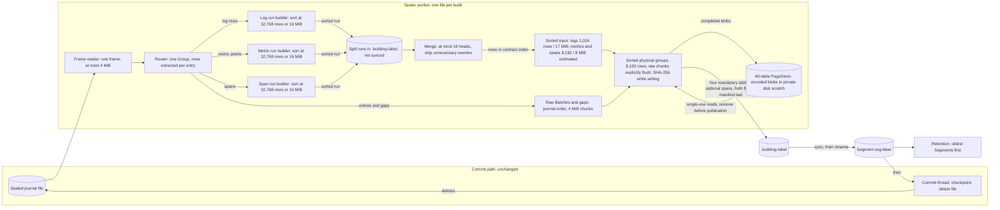
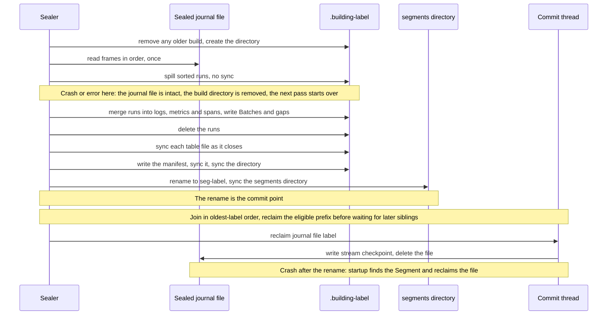

# Sealer

**Status: normal writer adopted and verified** ([ADR-0022](../decisions/ADR-0022-build-segments-by-external-merge-sort.md), amended after finite acceptance). Production workers use `segment::build_sealed`; the whole-file builder remains a differential reference. The [continuation](../experiments/formal/readiness-continuation-results.md) and [native R2 trial](../experiments/benchmarks/soak-run-02.md) record the builder and ten service gates. Unflagged bounded/recovery tests, loaded-binary equivalence and all 17 final fast checks support the default path. Schemas, Batch custody and publication order are unchanged; physical grouping can differ from the former byte-closing writer.

The sealer is part of [retained history](retained-history.md). It runs after ingestion has finished with a record: the [delivery](delivery.md) path has already synced the Batch to the journal and sent the ACK. The sealer never delays an ACK directly. It shares CPUs and the disk with the commit thread, and the journal cannot shrink until it finishes.

## The five questions

1. **What does it receive and produce?** It receives one sealed server journal file, `sealed-<label>.faj`, a frame log of Groups of Batches. It produces one Segment, `segments/seg-<label>`: four mandatory Zstd Parquet files, optional spans and a manifest ([ADR-0020](../decisions/ADR-0020-store-sealed-history-as-parquet-segments.md)).
2. **What promise does it make?** A query over the Segment returns what a query over the journal file would, with the same rows in the same order. A Segment is visible only when complete.
3. **Who owns the data before and after?** The journal file belongs to the journal until the Segment's rename commits. Then the commit thread checkpoints stream state and deletes the file. Until the rename, nothing the sealer does can lose a record.
4. **What can fail, and how is it visible?** A read error, a corrupt frame, a full disk or a crash. The build directory is removed, the journal file stays, and the error is logged on every pass until a retry succeeds ([failure states](#failure-states)).
5. **What would prove the design wrong?** A Segment that answers differently from today's, a peak heap that grows with the file, or a spill file left behind ([Validation in the ADR](../decisions/ADR-0022-build-segments-by-external-merge-sort.md#validation)).

## Architecture

<!-- diagram: ../diagrams/sealer.mmd -->


Reading the diagram: rows for the three sorted tables (logs, metrics and spans) take the long road through sorted runs on disk and a merge. The raw Batches and the gaps keep journal order, so they go straight to their writers. Everything is a stream except the three run builders, and those are capped.

The code stays in `fabric-server`, which is a composition root that holds its adapters ([system view](system.md#layers)). External sorting is a mechanism, not domain meaning: the order it must produce is already the contract's, and the retention decision stays in `fabric-core`. The design adds no crate, no dependency, no port and no configuration key.

## The algorithm

For one sealed file with label `L`:

```text
create .building-L                       (removing any older one)
for each frame in the file, in order:    one frame in memory, at most 4 MiB
    group = decode(frame)
    for each entry in group:
        batches_chunk.push(group_sequence, entry)        4 MiB cap, then written
        rows = extract(group_sequence, entry)
        gaps_writer.write(rows.gaps)
        for each log row:    log_run.push(row)           32,768 rows or 16 MiB
        for each span:       span_run.push(span)        32,768 rows or 16 MiB
        for each metric:     metric_run.push(point)      32,768 rows or 16 MiB
        when a run is full:  sort it by key, spill it as a run file
    update the manifest totals (first and last group, record count,
        receive-time bounds, newest time per node)
spill the last partial run of each table
for each of logs, metrics, spans:
    merge contiguous batches of at most 16 runs until at most 16 remain
        rewrite only enough runs to reach 16 when possible
        rename untouched runs into the next level
    heap = one row from the front of each remaining run
    while heap is not empty:
        row = heap.pop_min()
        input_chunk.push(row)
        logs: write at 1,024 rows or 17 MiB estimated input bytes
        metrics/spans: write at 8,192 rows or 8 MiB estimated input bytes
        close each sorted physical group at 8,192 rows
        spill completed encoded pages; consume each stored key once
        heap.push(next row of the same run)
    delete the runs
close the table writers, remove page scratch, sync each file,
write and sync the manifest,
sync the directory, rename to seg-L, sync the segments directory
```

The key is `(time, node identity, sequence, index)`, where time is `observed_ns` for logs and `time_ns` for metric points. Stable sorting and earlier-run tie precedence preserve journal order even for repeated keys.

### A worked example

Ten rows arrive with these times, and a run holds four rows:

| Step | Runs on disk | Memory |
| --- | --- | --- |
| rows 7 2 9 4 arrive | none | the four rows; full, so sort and spill |
| spilled | run 1: 2 4 7 9 | none |
| rows 1 8 3 6 arrive | run 1 | four rows; full, so sort and spill |
| spilled | run 1; run 2: 1 3 6 8 | none |
| rows 5 0 arrive, file ends | runs 1, 2 | two rows; spill as the last run |
| merge begins | run 1: 2 4 7 9; run 2: 1 3 6 8; run 3: 0 5 | the heads 2, 1 and 0 |
| merge pops 0, 1, 2, 3 | runs shrink as heads advance | three heads and a row group of four, which is written |
| merge pops 4 5 6 7, then 8 9 | all runs empty | row groups `[4 5 6 7]` and `[8 9]` |

The output is `0 1 2 3 4 5 6 7 8 9`, in three row groups with disjoint time ranges. Memory held at most four rows while cutting runs, and at most three heads plus a row group of four while merging.

### Why not simpler

Sorting each row-group-sized chunk alone is the same pipeline without the merge. It is the fastest and smallest option, but it leaves row groups whose time ranges overlap whenever rows arrive out of order, such as when a node comes back from an outage and sends its backlog. A query skips row groups by their time range, so overlapping ranges make every later query read more, for as long as the Segment lives. The merge buys disjoint ranges. The [study](../experiments/benchmarks/sealer-study-run-01.md) measured the difference: up to 5.7 times more rows read.

## Historical prototype budgets

These figures belong to the original two-sorted-table prototype. Current
three-signal buffers and metadata limits are described under Current behavior;
current finite measurements are in the linked run records.

| Resource | Design | Measured on the prototype |
| --- | --- | --- |
| Memory | about 80 MiB if every cap were full at once: 2 runs of 16 MiB, 4 row groups of 8 MiB, a 4 MiB Batches chunk, a 4 MiB frame plus its decoded Group | 42.5 to 45 MiB on four workloads and journal files from 16 to 256 MiB |
| Merge memory | a 64 KiB buffer and one row per run; about 9 runs for a 64 MiB file | included above |
| Disk during a seal | the journal file, the spill and the growing Segment: about 3 times the journal file at the peak | 64 + 73 + 48 MiB for a 64 MiB file |
| Spill | one extra write and read of the logs and metrics rows, about 1.1 times the journal file | 72.9 MiB for a 64 MiB file |
| Time | not a constraint: a journal file takes about 9 minutes to fill at 100 identities | 1.1 s on tmpfs; 1.07 to 1.21 s on a real disk |

Sizes in bytes are estimates from field lengths. The measured peak, not the arithmetic, is the evidence for the memory ceiling.

## Commit protocol

<!-- diagram: ../diagrams/sealer-commit.mmd -->


The protocol after the merge is ADR-0020's: every file synced, the manifest last, the directory renamed. The spill adds one rule: **runs are deleted before the manifest is written**, so spill never coexists with a committed Segment.

### Failure states

| Failure | State left | Recovery |
| --- | --- | --- |
| Read error or corrupt frame in the sealed file | `.building-L` | The builder removes it and returns the error. The file is kept. The next pass tries again and logs again |
| Disk full while spilling, merging or syncing | `.building-L`, journal file | The same. A full disk fails every pass until space returns |
| Crash before the rename | `.building-L` with runs, journal file | Startup `segment::cleanup` removes every `.building-*`; the sealer rebuilds from the journal file |
| Crash after the rename, before the file is deleted | `seg-L` and the journal file | Startup finds the Segment and reclaims the file, as today |
| A Segment later found corrupt | `seg-L` | Unchanged: queries report it in `unavailable` and the answer is incomplete |

A run file is never read after the build that wrote it, and it is not a durable format.

## Invariants

- **S-1.** The Segment holds exactly the rows and records of the journal file: no row lost, none duplicated.
- **S-2.** Within `logs.parquet` and `metrics.parquet`, rows follow the contract's order key, so row-group time ranges do not overlap.
- **S-3.** Peak heap while building does not grow with the size of the journal file or the shape of its rows, beyond the run count.
- **S-4.** A run file or build directory never outlives its build, whether it succeeds or fails.
- **S-5.** The journal file is deleted only after the Segment's rename, as before.
- **S-6.** The same input and constants give the same files, byte for byte.

These are claims of the design. The milestone assigns each a check; the
[verification matrix](../formal/verification-matrix.md) separates finite evidence,
experimental campaign results and remaining acceptance limits.

## Current behavior

The normal writer reads one encoded frame (at most 4 MiB), releases that payload after decoding, and processes entries individually. Three sorted run buffers each stop at 32,768 rows or 16 MiB estimated owned bytes. Merge fan-in is sixteen with multi-pass compaction; run buffers are released before merging. A cleanup guard removes owned build directories on errors while leaving the input journal intact. Floating-point values in private spill files are encoded as bits.

Sorted input chunks and physical Parquet groups have separate owners. Logs
align input writes to 1,024-row encoder batches with a 17 MiB estimated byte
target. Metrics and spans retain their 8,192-row/8 MiB estimated input bounds.
Every sorted table closes physical groups at 8,192 rows; filters accumulate over
that group. Single oversized rows are preserved even above an input target.
Raw Batch/gap chunks use 4 MiB targets and explicitly flush physical groups.
The estimates are not absolute heap bounds.

Every table uses Parquet's private disk `PageStore` in `.building-L`, including
raw tables. Encoding remains upstream; completed blobs become offset/length
locators, then are read through single-use keys. The last take deletes the file;
all page directories must be removed before manifest publication. Read, write or
cleanup errors prevent publication and leave journal custody intact. Legacy
`FABRIC_ROW_GROUP_CHUNKS_EXPERIMENT=1` and `FABRIC_PAGE_STORE_EXPERIMENT=1`
remain accepted build selectors but are unnecessary: unset now selects both paths.

The [encoded-page record](../experiments/formal/encoded-page-memory-run-01.md)
preserves the aligned-only entropy failure and disk-store correction. The
combined eight-cell/three-pair campaign passed exactness, pruning, determinism,
cleanup and the original heap/scaling gates. Native R2 passed all ten service
gates with the dedicated companion. These finite results do not bound arbitrary
blobs, metadata cardinality or total server memory.

Default verification passed 27 unflagged bounded tests and thirteen kill cuts
plus no-hit control. Four release artifacts were file-identical to the accepted
freeze. The server's complete ELF hash differed, but the validated comparison
matched all program headers, loaded segments and allocated-section bytes after
normalizing only section-table location and GNU build-id metadata; a `.text`
byte flip was rejected. Receipt:
`/run/media/kmosoti/data/FabricO11y/results/readiness-continuation-default-01/loaded-elf-equivalence.json`.
This is loaded-ELF equivalence, not full-file identity. All 17 final unflagged
fast checks and three manual documentation checks passed; receipts are linked
from the [default run](../experiments/formal/bounded-writer-default-run-01.md).

The same record reports seventeen scoped syscall fault cases with cleanup
checked before ordinary-error recovery, and thirteen named SIGKILL cuts plus
an unmatched-path control. Exact custody and all five mixed-signal query shapes
in Scan/Walk survived those cuts before and after restart under the unchanged
query oracle. These representative stages do not establish every instruction
boundary or physical power-loss behavior.

The fresh combined-selector fast profile passed all seventeen gates, including
layers and core purity; the separate dependency-policy check also passed.
Their command and receipt evidence is in the continuation. The original Clippy
failure remains recorded alongside its lint-only correction and successful rerun.

An experimental compile-time selector, `FABRIC_RUN_MIB_EXPERIMENT`, accepts
exactly `8`, `16` or `32`; unset retains the default 16 MiB run target. Invalid
values fail constant evaluation. Each signal has its own run buffer and estimated
owned-byte accounting, alongside the unchanged 32,768-row ceiling. A row larger
than the target is admitted alone and spilled before another row is added; the
target is therefore not an absolute allocation bound. Merge fan-in, output chunks,
ordering and custody/publication rules are unchanged. The diagram and algorithm
above describe the default setting.

The [native pruning protocol](../experiments/benchmarks/coupled-pruning-native-protocol.md)
and [false-positive follow-up](../experiments/benchmarks/coupled-pruning-false-positive-protocol.md)
inspect real footer bounds and decoded physical groups against producer identities.
The [coupled completion record](../experiments/benchmarks/coupled-completion-run-01.md)
records 42 exact query chains on that finite late-arrival/tie fixture and matching
Manifest/table files. These checks support conservative selection on the measured
fixture; admitted group cardinalities are not actual query IO, and the result does
not cover all workloads or clear the historical physical-count equality failure.

The [speed investigation](../experiments/benchmarks/sealer-speed-run-01.md)
replaces JSON scratch records with compact binary scalars and length-prefixed
UTF-8. At a fan-in boundary, only enough contiguous runs are merged to reach
sixteen; other run files move by rename. For eighteen runs this merges three
and carries fifteen forward, instead of rewriting eighteen. Stable ties,
table chunks, filters and publication ordering are preserved. The private
[codec](../../crates/fabric-server/src/segment/bounded/spill.rs) rejects invalid
lengths, UTF-8, scalar tags, duplicate attributes and trailing bytes.

These are payload-buffer limits, not a universal process bound: a decoded frame can expand, large individual rows can exceed a chunk target, and node freshness, filters and Parquet metadata grow. Each concurrent worker owns its buffers. Query Scan still decodes uncovered journal Groups, and Walk keeps a tail index. The [finite screen](../experiments/benchmarks/ingestion-memory-run-01.md) measured one builder with shuffled 1 KiB logs, not all those costs together.

Active and uncovered sealed journals are query sources before Segment publication. The owner's 30 seconds after ACK is experimental processing headroom, not a deliberate delay or a changed freshness contract. The [native lab screen](../experiments/benchmarks/dev-small-labs-run-02.md) records sampled source-write and ACK-stdout-observation to visibility around a first publication. These are polling bounds, not direct durability-to-queryable instrumentation. Its Scan/query-off matrix nominates query materialization as a separate memory cost; it does not replace builder heap acceptance.

Since [ADR-0025](../decisions/ADR-0025-carry-traces-as-a-third-signal.md) the sealer builds up to `seal_workers` Segments at once (default half the CPUs, one to four), one thread per journal file, because a Segment depends only on its own file. Journal files are reclaimed strictly oldest first, and not past the first file whose build failed, preserving checkpoint-before-delete and replay rules. Each bounded builder owns run and writer buffers; multiplying a historical single-builder peak by the worker count does not bound the whole server, which also owns ingest, queries and shared state.

The scheduler joins scoped workers in label order and attempts prefix reclamation
after each join. It no longer waits for every sibling before releasing an earlier
completed prefix. A missing or failed earlier label still blocks later labels.
On checkpoint error it stops reclaim attempts but joins all started workers;
reclaim errors take precedence over deterministic earliest-label build errors.
No new completion channel or background owner is introduced. The
[prefix-progress investigation](../experiments/benchmarks/catalog-cross-system-findings.md)
records the counterexample and verification status. Earlier checkpoint scheduling
can compete with ingest; its service-level performance remains unmeasured.

## Related

The [native ownership experiment](../experiments/benchmarks/native-ownership-findings.md)
adds a compile-time opt-in that releases source rows after successful conversion
and before Parquet encoding, dropping the RecordBatch before flush. Filtering and
publication order remain unchanged. Conversion/write error controls retain journal
custody. It reduced requested heap but failed a whole-worker RSS guard; the normal
source-row lifetime and 16 MiB run cap remain the defaults. This experiment changes
an internal lifetime, not the component/state diagram.

- [Retained history and query](retained-history.md) (the contract this design must not change)
- [Storage](storage.md) (the frame log and the journal)
- [ADR-0022](../decisions/ADR-0022-build-segments-by-external-merge-sort.md) and the [study](../experiments/benchmarks/sealer-study-run-01.md)
- [Bounded-sealer milestone](../milestones/bounded-sealer.md)
- [Coordinated lab investigation](../experiments/benchmarks/readiness-labs-run-01.md): finite shape measurements, physical filter-layout validation and remaining acceptance gaps.
