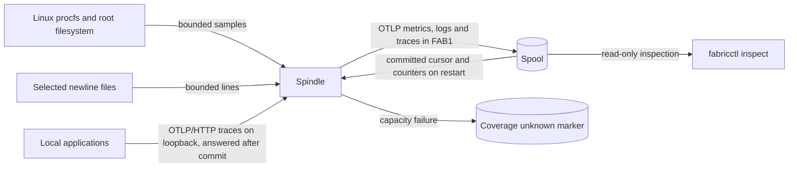

# Spindle

A Spindle is the host-resident FabricO11y collection role ([ADR-0017](../decisions/ADR-0017-name-the-spindle-and-the-strand.md)); the `fabric-node` executable runs it, and the code is under [src/spindle](../../src/spindle/mod.rs), with its Linux reads in the [fabric-adapter-linux](../../crates/fabric-adapter-linux/src/lib.rs) adapter and its counter-start, log-cursor and gap-text rules in [`fabric_core::collection`](../../crates/fabric-core/src/collection.rs). Status: implemented and tested; the native measurement protocol passed on an earlier revision ([run 02](../experiments/benchmarks/alpha-phase1-native-run-02.md)); see the [capability ledger](../QUALIFICATION.md#capability-ledger). The Spindle uses one process and a small synchronous loop; no watcher, plug-in, privileged helper or async runtime is part of it. Its Batches form one Strand per generation: `(SpindleId, generation)` with sequences 1, 2, 3, ... The local view below omits delivery, which the [delivery view](delivery.md) covers.

<!-- diagram: ../diagrams/spindle.mmd -->

The canonical source is [spindle.mmd](../diagrams/spindle.mmd). These paths are local; delivery to the server is not drawn here.

The Rust ownership rule is simple: a source read builds an owned candidate `Batch`; the node does not advance its in-memory cursor or forget source responsibility until `Spool::append` returns its committed batch after data and marker sync. On restart it reconstructs cursors and counter start information by streaming committed batches. The tradeoff is a linear replay of at most the configured spool cap and a stopped collector when its byte cap is exhausted. The spool keeps an ACK cursor and deletes whole sealed files at or below it ([storage view](storage.md)); without a server the cursor stays at zero and every batch is kept.

Supported telemetry profile: bounded OTLP protobuf export requests inside `FAB1`. Host resource attributes identify hostname and Linux boot ID. `/proc/stat` supplies aggregate CPU user/system/idle cumulative time in seconds (kernel clock ticks converted with `sysconf`); `/proc/meminfo` supplies total and available byte gauges; `statvfs("/")` supplies root filesystem capacity/available byte gauges; `/proc/diskstats` supplies cumulative read/write bytes per named device (512-byte sectors); `/proc/net/dev` supplies cumulative received/transmitted bytes per named interface. Counter points use cumulative monotonic Sum, observation time, and a start time that changes on detected decrease or boot ID change. Gauges carry observation time and units. Disk and interface cardinality are capped with explicit source failure; no implicit device filtering is claimed. No rate is fabricated from a Gauge.

Selected UTF-8 newline files produce OTLP LogRecords with observed time, source path and byte offsets. The file has no intrinsic event timestamp, so event time remains unknown. A committed cursor identifies path, device, inode, byte offset, a CRC32 witness of up to 64 consumed prefix bytes, and whether it is skipping an oversized line. The skip bit lets a 1 MiB bounded scan advance across a longer line over several cycles and restarts; only bytes after its newline can become a new record. On a new inode, shorter file or changed witnessed prefix, the node reports unknown prior coverage and starts the file from byte zero. It leaves incomplete normal lines uncommitted, marks overlong or invalid UTF-8 lines as gaps, and never slurps a whole file into memory. It opens selected paths nonblocking and rejects nonregular files promptly, so an unwritten FIFO cannot stall collection. A source permission or parsing failure is explicit. The collector permits at most 16 configured log paths, 64 disk devices, 64 network interfaces, 4 KiB per line, 8,192 lines and 1 MiB scanned per file per pass, and 928 KiB of log bytes per Batch across all files (the 1 MiB envelope cap less a 96 KiB reserve for the resource, cursors and gaps), with each line's encoding overhead (its path plus 256 bytes for its offsets and framing) counted against it, so a Batch never exceeds the cap. Files are visited in path order starting at a different file each batch, so one busy file cannot starve another. A pass that leaves unread bytes is followed by another as soon as delivery has caught up (and only then; while delivery is behind, passes stay one per second), so collection keeps pace with what the server accepts rather than with a fixed per-pass budget. On this machine that is about 3.6 MB/s of real log text per node, set by one Batch in flight and the server's 50 ms commit window ([spindle run 01](../experiments/benchmarks/spindle-run-01.md)). The Spool rotates only before a Batch carrying host metrics, so every retained file starts with counter state; when the active file reaches its 8 MiB rotation size, the next log pass also samples host metrics, so a log-heavy node keeps rotating and reclaiming between metric intervals; before ADR-0025 the cap was 128 lines, 256 KiB scanned and 64 KiB of bodies per one-second pass, 64 KiB/s per node. Unread bytes after each cycle are printed as `log_backlog_bytes`, and `fabricctl inspect` reports the same count from the last committed cursors, so lag is visible rather than silent. Eight gaps per log, one host failure and one coverage-unknown notice give a fixed worst case of 130 gaps in one batch; all configured sources are still visited, with later valid lines read from their saved cursors. These are local profile limits, not a general OTLP receiver. The [independent reader review](../experiments/formal/alpha-log-reader-repair.md) preserves the original counterexamples and repaired probes.

**Traces** ([ADR-0025](../decisions/ADR-0025-carry-traces-as-a-third-signal.md)). With `traces_listen` set to a loopback address (for example `127.0.0.1:4318`), `fabric-node run` serves `POST /v1/traces` with `application/x-protobuf` bodies, the OTLP/HTTP export every OpenTelemetry SDK supports ([otlp.rs](../../src/spindle/otlp.rs)). A body must decode as an `ExportTraceServiceRequest` and be at most 1 MiB less 96 KiB, the room every Batch keeps for its log cursors. Accepted exports go to the main loop over a bounded queue; the loop concatenates waiting exports into one Batch (field 9, `traces`), appends it to the Spool with the committed log cursors carried forward, and only then answers each exporter `200`. A full Spool, a paused node or a failed append answers `503` and the exporter retries; a malformed body `400`, a wrong media type `415`, an oversized body `413`. A non-loopback address is refused when the config loads. The endpoint uses plain threads (at most 32 connections, 64 queued exports) and keep-alive connections; there is no async runtime in the Spindle. While the endpoint is on, delivery runs in 200 ms slices so an exporter waits at most about that long for its commit.

**Metering** ([meter.rs](../../src/spindle/meter.rs)). The Spindle counts what it commits, by signal (encoded bytes and records for logs, metrics and traces), and what the server acknowledges (Batches and bytes), and reports them with every metric cycle as its own metrics: `fabric.spindle.committed.bytes` and `fabric.spindle.committed.records` with a `signal` attribute, `fabric.spindle.delivered.batches`, `fabric.spindle.delivered.bytes` and `fabric.spindle.throttled.seconds` (cumulative from the process start, so a restart reads as a counter reset), and the gauges `fabric.spindle.spool.bytes`, `fabric.spindle.unacked.batches` and `fabric.spindle.log.backlog.bytes`. They are queried on the server like any metric. The optional `max_output_bytes_per_s` (at least 65,536) caps delivery with a token bucket whose burst is one second or one full Batch, whichever is larger: a Batch is delayed, never refused, and a wait longer than the current delivery slice ends the slice instead of spinning. On restart the Spool's replay skips these metrics; only host counters have history to restore.

The prefix witness detects an ordinary same-inode replacement whose first witnessed bytes differ, including a truncate and regrow past the old offset. Identical witnessed prefixes, CRC32 collisions and changes outside the witnessed bytes can still be missed. Collection gaps report observed source failures, not a proof that the source never changed between observations.

`fabric-node` takes one local config path for `collect` (one cycle) or `run` (repeated cycles at interval boundaries). In `run`, SIGTERM or SIGINT ends the loop after the current cycle. If a cycle cannot commit, the node writes a `coverage-unknown` marker holding the attempt time, by synced rename; an existing marker it cannot read still means coverage is unknown, reported as "since an unrecorded time"; the next committed batch carries one `coverage unknown since <ns>` gap and the marker is then removed. A full spool keeps failing until space exists, so the notice appears only once a later batch commits. The config values are a spool path, selected log paths, metric interval, spool byte ceiling and, optionally, a delivery target given by `server_url`, `server_ca` and `token_file` together. With a target, the server's [central control](control-plane.md) may replace the log paths and interval; the node validates that view with the same rules, stores it as `applied-config.json` and runs it, including after a restart while the server is down. `run` samples metrics on the interval and reads logs every second, committing a logs-only batch only when there are new lines or gaps. With a target, `run` delivers pending batches between polls, one at a time, backing off from 250 ms to 5 s after a failed attempt; `collect` never sends. The cycle line reports `acked_through`. File-loaded and directly constructed configs use the same validation and log-path normalization before opening a spool. `fabricctl inspect` reads the same config to report journal identity, committed batch/metric/log counts, OTLP payload bytes, used bytes and coverage status. Inspection is read-only and can see an incomplete suffix during a concurrent append; it does not repair the journal. An in-progress marker under a live writer lock makes inspection retryable. A dead writer's in-progress marker reports `interrupted_append=true` with the counts reopen will keep. A recorded `recovery-required` reports that status and file size, with no records counted as committed. A marker appearing during a scan makes inspection retryable. Counter history holds only the latest complete sampled series, and restart replay holds cursors only for currently configured paths, so obsolete boots/devices and removed log sources do not accumulate in memory. Remote configuration arrives through [central control](control-plane.md). The [qualification ledger](../QUALIFICATION.md#capability-ledger) and [storage](storage.md) set the durable and qualification boundaries.
