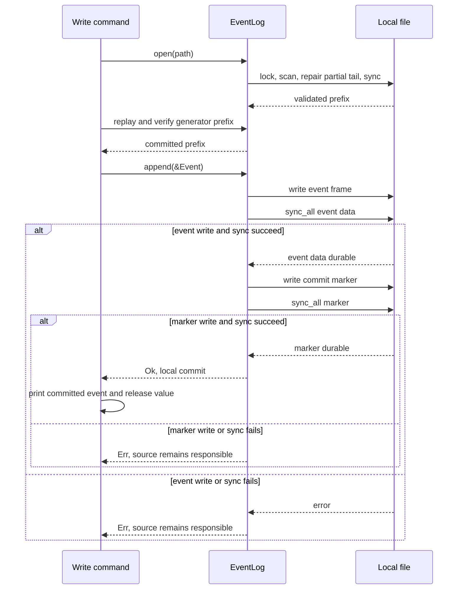

# Local append-only storage

## Purpose and boundary

The separate [S1 storage/query experiment](../experiments/ablation/storage-query-s1-run-01.md) uses this unchanged log for a verified replay-to-memory baseline. Its optional summaries are private in-memory research structures, not persisted indexes or a new log format. The [research agenda](../experiments/ablation/observability-storage-research.md) keeps disk blocks and Parquet as future comparisons.

Stage 5 adds a single-file [event log](../../src/log.rs) inside the Rust library. The optional `write` command drains the existing [buffer](../../src/buffer.rs) into this log; `replay` opens the file again and streams decoded events. The default command still prints batches without storing them. There is no network receiver or external ACK protocol.

`EventLog::append(&Event)` borrows the caller's event. It writes an event frame and syncs it, then writes a commit marker and syncs again. It returns `Ok(())` only after both syncs succeed. That return is the **local commit boundary** under the filesystem assumptions below. An error leaves the value with the caller, but a failed storage sync makes the file's durability uncertain. A later open cannot turn visible bytes into proof of durability; recovery after a storage I/O error needs an independent trusted copy on healthy storage.

## Write and recovery path

<!-- diagram: ../diagrams/storage.mmd -->

`open` takes a nonblocking advisory exclusive file lock, resolves the file path and syncs its actual parent directory, then scans frame-and-marker pairs. It removes a final event with no complete commit marker, including one whose event bytes are fully present. It syncs the repaired file before exposing recovered records. For a short header, recovery checks the magic, complete length when available, and available header-checksum bytes. For a short commit marker, it compares every present byte with the expected marker. An inconsistent checked field is an error; a plausible incomplete append is truncated. Payload bytes and their CRC are checked only when the entire payload is present. `replay` invokes a visitor for each committed event in file order, without collecting all events in the library. Opening a long log is still a linear scan; there is no index.

The CLI's `write <PATH> <SEED> <EVENTS>` reconstructs the deterministic synthetic source, compares the encoded bytes of existing records with its prefix, and appends only the missing suffix. Comparing encoded bytes distinguishes floating-point values such as `+0.0` and `-0.0` that Rust's ordinary numeric equality treats as equal. This permits a repeat of the same command after ordinary process termination without duplicating that prefix, provided no storage I/O error occurred. A different workload or a shorter requested count fails visibly. This resume rule is specific to the current generator and its locked version; `EventId` alone is not globally unique.

## Record format

Each committed record has a 16-byte event header, an encoded `Event`, and a 16-byte commit marker:

| Bytes | Meaning |
| --- | --- |
| 0–3 | ASCII `FOL2` event format marker |
| 4–7 | Little-endian `u32` payload length |
| 8–11 | CRC32 (IEEE) of the marker and length fields |
| 12–15 | CRC32 (IEEE) of the payload |
| 16 onward | Event fields with fixed-width little-endian numbers, tagged variants, and length-prefixed UTF-8 strings |

The marker immediately after the payload is `FOC2` (4 bytes), then the little-endian `u64` byte offset just after the event payload (8 bytes), then CRC32 of those first 12 marker bytes (4 bytes). Recovery accepts an event only with a complete valid marker at that offset. The `FOL2` marker distinguishes this two-sync format from the earlier in-progress `FOL1` layout; old files are rejected rather than silently reinterpreted.

The payload limit is 16 MiB. The encoder covers every current `Scalar` and `Payload` variant and preserves floating-point bits; it rejects an oversized event before touching the file. The checksum detects many accidental changes but does not authenticate data. The format is versioned by the marker; migration, compaction, and compatibility with other applications are not implemented. [ADR-0006](../decisions/ADR-0006-use-framed-local-log.md) records this initial storage choice.

## Failure behavior and assumptions

- A short final event frame with checked header fields consistent, a valid event frame without a marker, or a short marker whose present bytes match is treated as an interrupted append and truncated back to the last committed pair. The caller must retry the unacknowledged event. A partial payload is **not decoded**: even a present byte that would be an invalid event tag is truncated with the tail. Short headers or markers inconsistent with checked fields, and damaged fully present payloads or markers, stop recovery. Foreign bytes that match a plausible prefix cannot be distinguished from an interrupted append. A full-length but uncommitted payload or marker can be torn and fail its checksum; recovery fails closed because it cannot distinguish that from corruption of an acknowledged record.
- A write or sync error poisons that `EventLog` handle. If the event sync fails, no marker is written. If the marker write or sync fails, event data had synced, but a valid marker might remain visible without being durable. A later successful open or replay cannot prove that marker survived the failed sync. The CLI cannot recognize an earlier process's sync failure from the file alone; **do not automatically resume this path after a storage I/O error**. Repair the storage problem and rebuild the log from a separate trusted source. The generic caller must retain unacknowledged events and plan for duplicate delivery.
- The lock coordinates `EventLog` users that honor it. External modification, multiple writers ignoring the lock, filesystem corruption after a successful sync, and storage hardware that does not honor sync are outside this guarantee.
- The resolved target file's parent directory is synced on open so a newly created log filename is included before the first local commit, including when opened through a symlink. All ancestor directories and any symlink entries must themselves already have durable names; syncing the target's parent does not establish the durability of a newly created ancestor or symlink entry. The path must not be concurrently renamed or retargeted. The commit claim depends on the operating system and filesystem honoring successful `sync_all` calls, with no unresolved storage sync error. The tests simulate torn tails and restart; they do not simulate sudden power loss.
- Each append performs two file syncs. The [Stage 6 baseline](../experiments/benchmarks/local-log-stage6.md) measures one fixed local workload, but no comparative result selects this format as a throughput choice. A storage writeback error may cast doubt on earlier data too; the model assumes successful syncs establish durable copies and does not model failing hardware. No byte limit is imposed on the in-memory buffer, and replay output is still Debug text rather than a query API.

The [Stage 4 ownership model](../../formal/delivery/README.md) calls the successful append a `Commit`. `write` prints `committed event N` only after that point; this is a local acknowledgement observation, not a network ACK. The model's upstream copy corresponds here to a caller-owned `Event` before success and, for the CLI demonstration, to a reproducible seed/count source on restart. The general sender-retention and stable-global-identity assumptions remain open. See the [implementation checks](../experiments/formal/delivery-rust-stage5.md), [delivery view](delivery.md), and [learning path](../LEARNING_PATH.md).

## Current cost investigation

The optional `append-attribution` feature adds wall-clock samples around encoding,
data writes, each sync and marker write. It clears the sample before every attempt
and exposes one only after success; default builds contain no phase timers. It does
not change the FOL2 bytes, sync order or error/ownership contract. The
[S0 result](../experiments/benchmarks/append-attribution-s0.md) records exact replay,
paired controls and the material perturbation limit.

The [E2R group-seal model](../experiments/ablation/seal-e2-run-01.md) is separate
Python research tooling. It tests sector subsets, corruption and an external
failed-I/O witness; it is not an application durability change. Its cost comparison
and any physical storage validation are separate gates.
