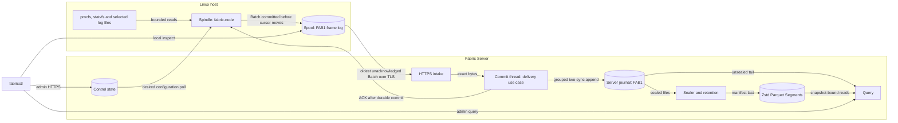
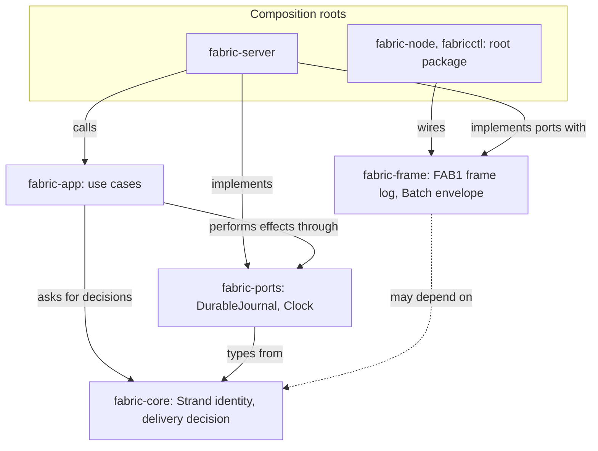

# System architecture

## Purpose

FabricO11y collects host observations with a Spindle, keeps custody of them in a durable Spool, delivers them over TLS to Fabric Server, commits them before acknowledging, retains them as a journal and immutable Segments, and answers queries that report completeness, freshness and gaps. The [product contract](../PRODUCT-CONTRACT.md) states the promises; this page states how the code is arranged to keep them. Status words follow the [evidence states](../QUALIFICATION.md#evidence-states): the components below are implemented and tested; qualification of the operating profile is outstanding.

## Runtime components

<!-- diagram: ../diagrams/system.mmd -->

The canonical source is [system.mmd](../diagrams/system.mmd).

| Component | Responsibility | Code | View |
| --- | --- | --- | --- |
| Spindle (`fabric-node`) | Bounded host and log collection, Batch construction, Spool custody, delivery, applying validated configuration | [src/spindle](../../src/spindle/mod.rs), [src/bin/fabric-node.rs](../../src/bin/fabric-node.rs) | [Spindle](spindle.md) |
| Spool | Durable `FAB1` frame log of Batches with an ACK cursor and whole-file reclaim | [src/spindle/spool.rs](../../src/spindle/spool.rs), [fabric-frame](../../crates/fabric-frame/src/frame.rs) | [storage](storage.md) |
| Delivery | One Batch in flight per Strand, exact stored bytes, ACK only after durable commit | [fabric-core delivery](../../crates/fabric-core/src/delivery.rs), [fabric-app delivery](../../crates/fabric-app/src/delivery.rs), [store](../../crates/fabric-server/src/store.rs) | [delivery](delivery.md) |
| Server journal | Grouped two-sync commits, Strand and binding state by replay, checkpoint before reclaim | [store](../../crates/fabric-server/src/store.rs) | [storage](storage.md) |
| Retained history | Zstd Parquet Segments, sealing off the commit path, retention by age and bytes | [segment](../../crates/fabric-server/src/segment.rs), [sealer](../../crates/fabric-server/src/sealer.rs) | [retained history](retained-history.md) |
| Query | Log, metric and rate queries with completeness, freshness, gaps and snapshot-bound pages | [query](../../crates/fabric-server/src/query.rs) | [retained history](retained-history.md) |
| Control | Enrollment, desired and applied configuration, pause, resume, revoke | [control](../../crates/fabric-server/src/control.rs) | [control](control-plane.md) |
| `fabricctl` | Local Spool inspection and the admin HTTPS client | [src/bin/fabricctl.rs](../../src/bin/fabricctl.rs) | [operations](../operations.md) |

## Layers

[ADR-0015](../decisions/ADR-0015-adopt-a-hexagonal-architecture.md) sets the dependency rule: domain semantics point inward, effects point outward. [layers.json](layers.json) assigns each crate a layer and `cargo xtask check-layers` enforces it.

<!-- diagram: ../diagrams/layers.mmd -->

The canonical source is [layers.mmd](../diagrams/layers.mmd).

| Crate | Layer | Holds |
| --- | --- | --- |
| [fabric-core](../../crates/fabric-core/src/lib.rs) | core | `SpindleId`, `StrandId`, `next_sequence`, the delivery decision and group plan. `no_std`, no dependencies ([ADR-0016](../decisions/ADR-0016-keep-a-pure-semantic-core.md)) |
| [fabric-ports](../../crates/fabric-ports/src/lib.rs) | ports | `DurableJournal`, `Clock` |
| [fabric-app](../../crates/fabric-app/src/lib.rs) | app | `commit_group`: the delivery use case |
| [fabric-frame](../../crates/fabric-frame/src/lib.rs) | adapter support | the `FAB1` rotating frame log and the version-one `Batch` envelope |
| [fabric-server](../../crates/fabric-server/src/lib.rs) | composition root | HTTP/TLS, the journal adapter, control, segments, sealer, query, and `main` |
| root package `fabric_o11y` | composition root | the Spindle runtime and its Linux, Spool and HTTP-client adapters; `fabric-node`, `fabricctl`; the FOL2 demonstration |
| [xtask](../../xtask/src/main.rs) | tooling | layer, purity, check-registry and mutant runners |

Both composition roots still contain adapters and some domain policy (control transitions, query and rate semantics, retention eligibility, collection cursor rules). The layer gate sees crates, not modules, so that policy is not yet protected; extracting it is the [semantic-kernels milestone](../ROADMAP.md). One documented exception remains: `fabric-server`'s end-to-end tests depend on the root package (development dependency only) to run a real Spindle.

## Invariants

- The core performs no I/O and reads no ambient state; decisions are data.
- An ACK follows a durable commit of the Batch or of the earlier Batch it acknowledges.
- The Spindle never forgets an unacknowledged Batch; it moves a source cursor only in the same commit as the collected lines.
- Query execution never mutates stored telemetry.
- Wire and persisted bytes (`FOL2`, `FAB1`, envelope field numbers, checkpoint format) do not change with a type move.

## Boundaries not in this system

No general OTLP receiver, traces, UI, plugin boundary, or async runtime in the Spindle. Research packages under `tools/` (storage, layout, transport and seal probes) and the agent-telemetry tooling are outside the product; see [architecture views](README.md).

## Related decisions

[ADR-0005](../decisions/ADR-0005-ack-after-durable-commit.md), [ADR-0010](../decisions/ADR-0010-use-static-systemd-services-for-alpha.md), [ADR-0011](../decisions/ADR-0011-separate-interrupted-append-from-known-failure.md), [ADR-0012](../decisions/ADR-0012-add-a-server-crate-in-a-workspace.md), [ADR-0013](../decisions/ADR-0013-deliver-batches-in-order-with-bounded-dedup.md), [ADR-0014](../decisions/ADR-0014-manage-nodes-through-server-control-state.md), [ADR-0015](../decisions/ADR-0015-adopt-a-hexagonal-architecture.md) to [ADR-0019](../decisions/ADR-0019-keep-release-maturity-in-tags.md).

## Open questions

- Whether control, query and retention kernels stay `no_std` once floating-point rate arithmetic moves into the core.
- When to rename the `fabric-node` executable to `fabric-spindle` ([ADR-0017](../decisions/ADR-0017-name-the-spindle-and-the-strand.md)).
- How to map fault-harness transcripts onto the delivery TLA+ actions ([verification strategy](../formal/verification-strategy.md)).
