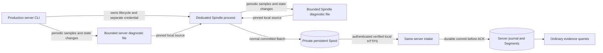
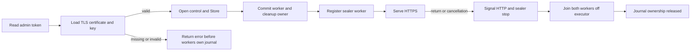
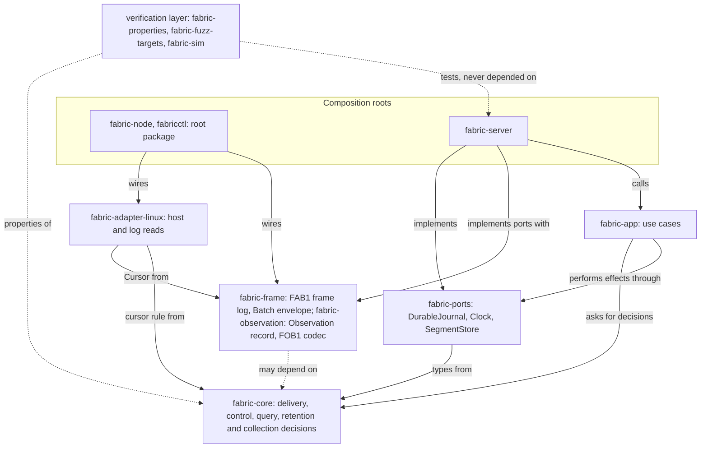

# System architecture

## Purpose

FabricO11y collects host observations with a Spindle, keeps custody of them in a durable Spool, delivers them over TLS to Fabric Server, commits them before acknowledging, retains them as a journal and immutable Segments, and answers queries that report completeness, freshness and gaps. The [product contract](../PRODUCT-CONTRACT.md) states the promises; this page states how the code is arranged to keep them. Status words follow the [evidence states](../QUALIFICATION.md#evidence-states): the components below are implemented and tested; qualification of the operating profile is outstanding.

## Runtime components

```mermaid
flowchart LR
    subgraph Host[Linux host]
        Sources[procfs, statvfs and selected log files]
        Spindle[Spindle: fabric-node]
        Spool[(Spool: FAB1 frame log)]
        Sources -->|bounded reads| Spindle
        Spindle -->|Batch committed before cursor moves| Spool
    end
    subgraph Central[Fabric Server]
        Intake[HTTPS intake]
        Commit[Commit thread: delivery use case]
        Journal[(Server journal: FAB1)]
        Sealer[Sealer and retention]
        Segments[(Zstd Parquet Segments)]
        Query[Query]
        Control[(Control state)]
        Intake -->|exact bytes| Commit
        Commit -->|grouped two-sync append| Journal
        Journal -->|sealed files| Sealer
        Sealer -->|manifest last| Segments
        Sealer -->|published prefix before and between build groups| Commit
        Commit -->|checkpoint then oldest journal reclaim| Journal
        Journal -->|unsealed tail| Query
        Segments -->|snapshot-bound reads| Query
    end
    Spool -->|oldest unacknowledged Batch over TLS| Intake
    Commit -->|ACK after durable commit| Spindle
    Control -->|desired configuration poll| Spindle
    UI[Leptos PWA] -->|passkey session| Access[Scoped console API]
    CLI[fabricctl] -->|workload credential| Access
    Access -->|authorized mutation| Control
    Access -->|authorized sources and signals| Query
    CLI -->|local inspect| Spool
```

<!-- diagram: ../diagrams/system.mmd -->

The canonical source is [system.mmd](../diagrams/system.mmd).

| Component | Responsibility | Code | View |
| --- | --- | --- | --- |
| Spindle (`fabric-node`) | Bounded host and log collection, Batch construction, Spool custody, delivery, applying validated configuration | [src/spindle](../../src/spindle/mod.rs), [src/bin/fabric-node.rs](../../src/bin/fabric-node.rs) | [Spindle](spindle.md) |
| Spool | Durable `FAB1` frame log of Batches with an ACK cursor and whole-file reclaim | [src/spindle/spool.rs](../../src/spindle/spool.rs), [fabric-frame](../../crates/fabric-frame/src/frame.rs) | [storage](storage.md) |
| Delivery | One Batch in flight per Strand, exact stored bytes, ACK only after durable commit | [fabric-core delivery](../../crates/fabric-core/src/delivery.rs), [fabric-app delivery](../../crates/fabric-app/src/delivery.rs), [store](../../crates/fabric-server/src/store.rs) | [delivery](delivery.md) |
| Server journal | Grouped two-sync commits, Strand and binding state by replay, checkpoint before reclaim | [store](../../crates/fabric-server/src/store.rs) | [storage](storage.md) |
| Retained history | Zstd Parquet Segments, external-sort sealing off the commit path, retention by age and bytes | [segment](../../crates/fabric-server/src/segment.rs), [bounded builder](../../crates/fabric-server/src/segment/bounded.rs), [sealer](../../crates/fabric-server/src/sealer.rs) | [retained history](retained-history.md), [sealer candidate](sealer.md) |
| Query | Log, metric and rate queries with completeness, freshness, gaps and snapshot-bound pages | [query](../../crates/fabric-server/src/query.rs) | [retained history](retained-history.md) |
| Control | Enrollment, desired and applied configuration, pause, resume, revoke | [control](../../crates/fabric-server/src/control.rs) | [control](control-plane.md) |
| `fabricctl` | Local Spool inspection and the admin HTTPS client | [src/bin/fabricctl.rs](../../src/bin/fabricctl.rs) | [operations](../operations.md) |

## Server startup

The production `fabric-server serve` CLI now owns a dedicated local Spindle
([ADR-0026](../decisions/ADR-0026-launch-a-dedicated-spindle-with-each-server.md)).
Its process owner holds a state-directory lock, provisions a separate durable
credential and starts the sibling `fabric-node` after the actual HTTPS listener
is available. The child verifies TLS and authentication on its initial config
poll. A child exit fails the supervisor; normal shutdown offers the child time
to finish its current cycle while HTTP remains available. Both processes inherit
the server service's cgroup. The [deployment view](deployment.md) documents
limits, paths, overrides and operator pause behavior.

<!-- diagram: ../diagrams/self-observation.mmd -->

The canonical source is [self-observation.mmd](../diagrams/self-observation.mmd).
Periodic samples and state transitions avoid per-Batch logging feedback. These
files are best effort until committed to the Spool; they do not replace custody
records or independently observe a failed host. Edge Spindles retain their
configured destination. Library embedding through `fabric_server::serve` leaves
process composition to the caller.

The library serving primitive validates the admin token and TLS certificate/key before opening
the Store and starting commit/sealer workers. This order prevents a TLS error
from returning while a background owner keeps the journal locked. The
[startup counterexample and native lifecycle](../experiments/benchmarks/catalog-native-lifecycle-findings.md)
record the original failure and same-process retry correction. A private
[worker owner](../../crates/fabric-server/src/lifecycle_workers.rs) now starts
cleanup immediately after commit startup. Dropping the serving future signals
HTTP and sealer shutdown; the already-scheduled cleanup joins both workers off
the executor. Ordinary completion waits for cleanup and reports worker panics,
preserving a primary startup/bind error. The
[transition investigation](../experiments/benchmarks/catalog-transition-ownership-findings.md)
reproduced cancellation's former journal-lock leak. A blocking filesystem call
can still delay termination.

<!-- diagram: ../diagrams/server-startup.mmd -->

The canonical source is [server-startup.mmd](../diagrams/server-startup.mmd).

HTTP admits at most 16 batch requests and two query requests through independent
nonwaiting pools before buffering their bodies. Overload returns 503 with
Retry-After 1. A query's Rust-owned permit moves into its blocking scan, so a
cancelled async waiter cannot admit another scan while that work continues.
These limits cover those request/work stages; they do not bound all connection,
response or administrative-route memory. See the [delivery boundary](delivery.md)
and [query implementation](retained-history.md#implementation-notes).

## Layers

[ADR-0015](../decisions/ADR-0015-adopt-a-hexagonal-architecture.md) sets the dependency rule: domain semantics point inward, effects point outward. [layers.json](layers.json) assigns each crate a layer and `cargo xtask check-layers` enforces it.

<!-- diagram: ../diagrams/layers.mmd -->

The canonical source is [layers.mmd](../diagrams/layers.mmd).

| Crate | Layer | Holds |
| --- | --- | --- |
| [fabric-core](../../crates/fabric-core/src/lib.rs) | core | `SpindleId`, `StrandId`, `next_sequence`; the delivery decision and group plan; control transitions and shape limits; query window, page, snapshot, completeness and counter-step rules; retention eligibility; counter start, log-cursor and gap-text rules. `no_std`, no dependencies ([ADR-0016](../decisions/ADR-0016-keep-a-pure-semantic-core.md)) |
| [fabric-ports](../../crates/fabric-ports/src/lib.rs) | ports | `DurableJournal`, `Clock`, `SegmentStore` |
| [fabric-app](../../crates/fabric-app/src/lib.rs) | app | `commit_group` (delivery) and `apply_retention` (retention) |
| [fabric-frame](../../crates/fabric-frame/src/lib.rs) | adapter support | the `FAB1` rotating frame log and the version-one `Batch` envelope |
| [fabric-observation](../../crates/fabric-observation/src/lib.rs) | adapter support | the version-one `Observation` record (line, point or span) and its canonical `FOB1` block codec, built from the bits up as a [tower of levels](observation.md) with no dependencies; accepted in [ADR-0023](../decisions/ADR-0023-define-an-observation-record-with-a-canonical-encoding.md) for the opt-in Walk plan’s in-memory journal-tail blocks |
| [fabric-server](../../crates/fabric-server/src/lib.rs) | composition root | HTTP/TLS, the journal adapter, control, segments, sealer, query, and `main` |
| [fabric-adapter-linux](../../crates/fabric-adapter-linux/src/lib.rs) | adapter | bounded `/proc` and `statvfs` sampling and newline log reading for the Spindle |
| root package `fabric_o11y` | composition root | the Spindle runtime, its Spool and HTTP client; `fabric-node`, `fabricctl`; the FOL2 demonstration |
| [xtask](../../xtask/src/main.rs) | tooling | layer, purity, check-registry and mutant runners |
| [fabric-properties](../../crates/fabric-properties/src/lib.rs), [fabric-fuzz-targets](../../crates/fabric-fuzz-targets/src/lib.rs), [fabric-sim](../../crates/fabric-sim/src/lib.rs) | verification | property tests of the kernels, fuzz target bodies and corpus replay, and the turmoil network simulation; they may depend on any product crate and none depends on them ([ADR-0021](../decisions/ADR-0021-add-property-model-fuzz-and-simulation-checks.md)) |

The domain decisions the composition roots used to make inline (control transitions, query and rate semantics, retention eligibility, counter and cursor rules) are kernels in `fabric-core` since the [semantic-kernels milestone](../milestones/semantic-kernels.md), each guarded by a differential test against the code it replaced. The roots still contain their adapters: `fabric-server` holds the journal, Segment, control-persistence and query-read code, and the root package holds the Spindle runtime and Spool. The layer gate sees crates, not modules. One documented exception remains: `fabric-server`'s end-to-end tests depend on the root package (development dependency only) to run a real Spindle.

## Invariants

- The core performs no I/O and reads no ambient state; decisions are data.
- An ACK follows a durable commit of the Batch or of the earlier Batch it acknowledges.
- The Spindle never forgets an unacknowledged Batch; it moves a source cursor only in the same commit as the collected lines.
- Query execution never mutates stored telemetry.
- Wire and persisted bytes (`FOL2`, `FAB1`, envelope field numbers, checkpoint format) do not change with a type move.

## Boundaries not in this system

No general OTLP receiver, traces, UI, plugin boundary, or async runtime in the Spindle. Research packages under `tools/` (storage, layout, transport and seal probes) and the agent-telemetry tooling are outside the product; see [architecture views](README.md).

## Related decisions

[ADR-0005](../decisions/ADR-0005-ack-after-durable-commit.md), [ADR-0010](../decisions/ADR-0010-use-static-systemd-services-for-alpha.md), [ADR-0011](../decisions/ADR-0011-separate-interrupted-append-from-known-failure.md), [ADR-0012](../decisions/ADR-0012-add-a-server-crate-in-a-workspace.md), [ADR-0013](../decisions/ADR-0013-deliver-batches-in-order-with-bounded-dedup.md), [ADR-0014](../decisions/ADR-0014-manage-nodes-through-server-control-state.md), [ADR-0015](../decisions/ADR-0015-adopt-a-hexagonal-architecture.md) to [ADR-0020](../decisions/ADR-0020-store-sealed-history-as-parquet-segments.md).

## Open questions

- When to rename the `fabric-node` executable to `fabric-spindle` ([ADR-0017](../decisions/ADR-0017-name-the-spindle-and-the-strand.md)).
