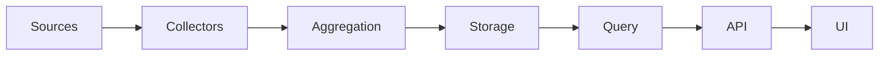
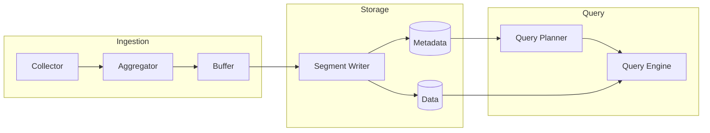

# Documentation policy

This policy applies to humans and agents. The [documentation landing page](README.md) defines the navigation. The owner selected a separate GitHub wiki for research, experiment results and observations on 2026-10-10; the ownership rules below supersede older instructions that put every research record in this repository.

## Canonical ownership

| Material | Authoritative location |
| --- | --- |
| Product promises, operator instructions, current state, roadmap and release plan | This repository |
| Architecture, diagrams, glossary, ADRs, formal models and invariants | This repository, versioned with the implementation |
| Registered protocols, decision rules, independent oracles, negative controls, regression fixtures and machine-consumed inputs | This repository; existing specification protection applies |
| Research, prior-art reviews, experimental results, observations and interpretations | [FabricO11y research wiki](https://github.com/kmosoti/FabricO11y/wiki) |
| Raw telemetry, credentials, fixtures, binaries and large run archives | Controlled data-drive evidence storage; publish only reviewed, bounded summaries |

Each document has one editable canonical home. Repository links to migrated
reports are compatibility pointers, not second copies. Historical results retain
their measured revision, workload, failures and limits. Moving a report never
makes its results current or qualifies a release. Mixed records that also define
a registered procedure or are consumed by a harness stay versioned with code;
the wiki links them instead of replacing their bytes.

Before removing a report body from the repository, record its source path and
SHA-256, publish the corresponding wiki page, read back the exact Git commit and
verify the exported bytes. Preserve the original text in an owned data-drive
archive and repair navigation, including heading links. Retain an explicit
migration manifest and any exclusions. Do not rewrite historical Git commits.
An unavailable wiki does not permit discarding the local evidence.

Do not recursively upload evidence directories. Review wiki-bound text for
credentials and collected payloads; a pattern scan alone is not clearance.
Keep source hashes and archive locations in the evidence inventory. Private
archives remain private, and an unavailable raw artifact is identified honestly.
Future reports go directly to the wiki, with commands, outcomes, measurement
definitions, revision, resource and cleanup receipts, and interpretation limits.

### Controlled evidence references

Historical procedures and machine inputs retain their original bytes when raw
run archives move to controlled storage. Their exact private references are
declared in [controlled-evidence-references.json](controlled-evidence-references.json).
The documentation checker requires the exact source SHA-256 and exact normalized
repository-relative target. Only experiment `data/` paths are eligible; absolute
paths, traversal segments, wildcards and out-of-scope targets are rejected. The
inventory is bounded to 128 references and 256 KiB. Changes to this exception or
inventory are verification-policy changes and require their own reasoned commit.

Declared references are counted as **private/unavailable, not validated links**.
The checker never follows, opens or validates their private targets. They remain
unavailable in a fresh checkout, whether a local archive symlink exists or not.
Source hash drift invalidates the declaration. Every unregistered missing link
or link escaping the repository retains the ordinary failure behavior; the
declaration does not establish an archive's contents or a historical result.

## Purpose

This repository must maintain a living architectural model alongside the implementation.

The documentation system is designed for two simultaneous consumers:

1. Humans browsing the repository locally in Visual Studio Code or remotely on GitHub.
2. Coding agents such as Codex that need a compact, inspectable representation of the current architecture, design rationale, implementation state, and unresolved questions.

The documentation must remain:

- repository-native for the product and verification contract; Git-backed wiki for research
- text-based
- Git-friendly
- GitHub-renderable
- machine-editable
- easy to diff
- easy to validate
- structurally useful to coding agents
- independent of proprietary documentation platforms

The preferred local authoring environment is Visual Studio Code using:

- Foam
- Mermaid Preview
- Mermaid Visual Diff
- CodeTour
- optionally ceasg for manual Mermaid editing

These extensions improve the local experience but are not dependencies of the repository.

The repository must remain understandable and navigable directly from GitHub.

---

# 1. Core principle

Treat architecture documentation as part of the implementation.

Do not treat `/docs` as an after-the-fact documentation dump.

Architecture changes, implementation changes, experiments, and important engineering decisions must remain synchronized.

The repository should make it possible to answer:

- What exists?
- How do the components relate?
- How does data move?
- How does control move?
- What state machines exist?
- What assumptions are currently relied upon?
- Why were major architectural decisions made?
- What evidence supports those decisions?
- What is currently being worked on?
- What remains unresolved?
- Does the documented architecture still match the implementation?

---

# 2. Repository structure

Create and maintain this structure where applicable:

```text
.
├── AGENTS.md
├── README.md
│
├── docs/
│   ├── README.md
│   ├── CURRENT.md
│   ├── glossary.md
│   │
│   ├── architecture/
│   │   ├── README.md
│   │   ├── system.md
│   │   ├── ingestion.md
│   │   ├── storage.md
│   │   ├── query.md
│   │   ├── control-plane.md
│   │   └── deployment.md
│   │
│   ├── diagrams/
│   │   ├── system.mmd
│   │   ├── data-flow.mmd
│   │   ├── control-flow.mmd
│   │   ├── state-machines.mmd
│   │   └── deployment.mmd
│   │
│   ├── concepts/
│   │   ├── README.md
│   │   └── <concept>.md
│   │
│   ├── decisions/
│   │   ├── README.md
│   │   └── ADR-XXXX-<decision>.md
│   │
│   ├── experiments/
│   │   ├── README.md
│   │   ├── ablation/
│   │   └── benchmarks/
│   │
│   └── tours/
│       └── README.md
│
└── .vscode/
    └── extensions.json
```

Do not create empty directories merely to satisfy this layout.

Create sections when they become useful.

---

# 3. GitHub compatibility is the baseline

All canonical documentation must render sensibly on GitHub.

Use GitHub-compatible Markdown.

Use ordinary relative Markdown links for primary navigation.

Preferred:

```markdown
[Aggregator](../concepts/aggregator.md)
```

Do not rely on Foam-style wikilinks as the only way to navigate canonical documentation.

Foam wikilinks may be used as an additional local semantic layer:

```markdown
[[aggregator]]
[[segment-writer]]
[[query-engine]]
```

If a document is important for GitHub navigation, also provide an ordinary Markdown link.

The repository must still make sense to a reader who has never installed Foam.

---

# 4. Root README responsibilities

The root `README.md` must remain concise.

It should explain:

- what the project is
- what problem it solves
- the current maturity level
- the main architectural idea
- how to build or run it
- where the detailed architecture lives

Include a direct link to:

```markdown
[Architecture documentation](docs/README.md)
```

Do not turn the root README into the complete architectural specification.

---

# 5. Documentation landing page

`docs/README.md` is the primary architecture landing page.

It should contain:

1. a short system description
2. one high-level Mermaid diagram
3. links to the main architectural views
4. links to concepts
5. links to architectural decisions
6. links to experiments
7. a link to `CURRENT.md`

Example structure:

````markdown
# Architecture

## System overview



## Architecture views

- [System architecture](architecture/system.md)
- [Ingestion](architecture/ingestion.md)
- [Storage](architecture/storage.md)
- [Query](architecture/query.md)
- [Deployment](architecture/deployment.md)

## Engineering model

- [Concepts](concepts/README.md)
- [Architecture decisions](decisions/README.md)
- [Experiments](experiments/README.md)
- [Current project state](CURRENT.md)
````

---

# 6. Mermaid is the canonical visual language

Use Mermaid for architectural diagrams unless another representation is clearly necessary.

Prefer text-based diagrams over images.

Mermaid diagrams must remain editable by both humans and agents.

Use standalone `.mmd` files under:

```text
docs/diagrams/
```

for canonical machine-editable visual models.

Architecture Markdown pages may also embed Mermaid directly where doing so improves readability on GitHub.

---

# 7. Diagram projections

Do not attempt to express the entire system in one diagram.

Maintain multiple projections.

At minimum, use these when relevant.

## 7.1 System structure

File:

```text
docs/diagrams/system.mmd
```

Purpose:

Show major components and ownership boundaries.

Preferred diagram type:

```text
flowchart LR
```

Answer:

- What are the major subsystems?
- What depends on what?
- Where are major boundaries?

---

## 7.2 Data flow

File:

```text
docs/diagrams/data-flow.mmd
```

Purpose:

Show how data moves through the system.

Answer:

- Where does data originate?
- What transforms it?
- Where is it buffered?
- Where is it persisted?
- Where does it become queryable?

Use either:

```text
flowchart LR
```

or:

```text
sequenceDiagram
```

depending on whether topology or temporal interaction is more important.

---

## 7.3 Control flow

File:

```text
docs/diagrams/control-flow.mmd
```

Purpose:

Show orchestration, coordination, scheduling, control-plane operations, retries, acknowledgements, lifecycle transitions, or management flows.

Do not conflate control flow with data flow.

---

## 7.4 State machines

File:

```text
docs/diagrams/state-machines.mmd
```

Purpose:

Represent lifecycle states when correctness depends on permitted transitions.

Preferred type:

```text
stateDiagram-v2
```

State diagrams are especially important for:

- controllers
- workflows
- maintenance systems
- distributed jobs
- recovery behavior
- agents
- schedulers
- resource lifecycle management

---

## 7.5 Deployment topology

File:

```text
docs/diagrams/deployment.mmd
```

Purpose:

Represent process, service, host, runtime, cluster, network, or infrastructure placement.

Do not mix logical architecture and deployment topology unless the distinction is explicitly shown.

---

# 8. Diagram quality rules

Mermaid diagrams must remain readable.

Prefer:

```text
flowchart LR
```

for pipelines and peer relationships.

Prefer:

```text
flowchart TB
```

for hierarchies.

Use subgraphs for meaningful subsystem boundaries.

Example:



Avoid:

- giant global graphs
- decorative styling
- arbitrary colors
- Mermaid styling that only works in one theme
- unnecessary implementation-level symbols
- showing every function or file
- edges without semantic meaning
- diagrams with dozens of crossing arrows

A useful default is fewer than roughly 15 visible nodes per architectural view.

This is not a hard limit.

Split diagrams when comprehension deteriorates.

---

# 9. Architecture pages

Files under:

```text
docs/architecture/
```

explain architecture in prose.

Each architecture page should generally contain:

```markdown
# <Architecture area>

## Purpose

## Responsibilities

## Boundaries

## Components

## Data flow

## Control flow

## Failure behavior

## Invariants

## Dependencies

## Related decisions

## Related experiments

## Open questions
```

Only include sections that materially help.

Do not mechanically populate empty headings.

---

# 10. Concepts

Use:

```text
docs/concepts/
```

for important domain concepts.

Concept pages should explain semantic meaning rather than merely mirror code.

Examples:

```text
collector
aggregator
segment
partition
schema
index
query-plan
runtime
worker
controller
```

A concept page should typically answer:

- What is this thing?
- Why does it exist?
- What owns it?
- What does it consume?
- What does it produce?
- What invariants apply?
- What concepts does it relate to?
- Which implementation modules realize it?

Example:

```markdown
# Aggregator

The aggregator receives telemetry from collectors and produces normalized batches.

## Responsibilities

- schema normalization
- batching
- backpressure
- enrichment
- routing

## Inputs

- collector events
- schema metadata

## Outputs

- normalized batches

## Invariants

- input ordering must not be silently fabricated
- rejected data must be observable
- backpressure must remain bounded

## Related

- [Collector](collector.md)
- [Segment](segment.md)
- [Ingestion architecture](../architecture/ingestion.md)
```

Concept terminology must remain stable.

When a term changes meaning, update the glossary and affected pages.

---

# 11. Glossary

Maintain:

```text
docs/glossary.md
```

for project-specific terminology.

The glossary exists partly to prevent semantic drift between:

- code
- documentation
- humans
- agents

Define terms precisely.

Avoid multiple words for the same abstraction unless there is a genuine distinction.

If implementation introduces a new foundational term, update the glossary when appropriate.

---

# 12. Architecture Decision Records

Store Architecture Decision Records under:

```text
docs/decisions/
```

Use sequential numbering.

Example:

```text
ADR-0001-use-arrow-for-internal-columnar-batches.md
ADR-0002-use-parquet-for-durable-segments.md
```

Use this structure:

```markdown
# ADR-XXXX: <Decision>

## Status

Proposed | Accepted | Superseded | Rejected | Experimental

## Context

What problem or constraint prompted this decision?

## Decision

What is being chosen?

## Alternatives considered

What realistic alternatives were considered?

## Evidence

What benchmarks, experiments, literature, implementation evidence, or operational constraints support the decision?

## Consequences

What becomes easier?

What becomes harder?

What new constraints are introduced?

## Validation

How can this decision be tested or falsified?

## Related

Links to architecture, experiments, issues, code, or other ADRs.
```

Do not create an ADR for trivial implementation decisions.

Create ADRs for decisions that materially affect:

- architecture
- interoperability
- performance
- correctness
- storage format
- protocol
- deployment model
- security boundary
- concurrency model
- public API
- long-term maintainability

---

# 13. Experiments and ablation work

Keep registered protocols, executable evidence inputs and the evidence index in
`docs/experiments/`. Store research reports, results and observations in the
[wiki](https://github.com/kmosoti/FabricO11y/wiki), following canonical ownership
above. The repository index links the two; it does not duplicate report bodies.

Important architectural claims should be supported by evidence where practical.

Examples:

- Arrow vs custom records
- SQLite vs alternative metadata stores
- Parquet encoding choices
- serialization format comparisons
- batching strategy
- backpressure strategy
- queue implementation
- synchronization strategy
- compression
- transport protocol
- index design

Experiment documents should clearly separate:

- hypothesis
- setup
- variables
- measurement methodology
- results
- interpretation
- limitations
- decision impact

Do not present benchmark results without enough context to reproduce them.

Do not convert one benchmark result into a universal architectural rule.

---

# 14. CURRENT.md

Maintain:

```text
docs/CURRENT.md
```

This is the compact working-state document for humans and agents.

It should reflect the current repository state, not project mythology.

Recommended structure:

```markdown
# Current Project State

## Active work

## Recently completed

## Architecture currently affected

## Current assumptions

## Unresolved questions

## Known risks

## Current experiments

## Next validation steps
```

Keep it concise.

Do not turn it into a changelog.

Git already stores history.

`CURRENT.md` describes the present engineering state.

Update it when:

- active architectural work changes
- a major assumption changes
- an unresolved question is closed
- a new critical risk appears
- an experiment changes the likely direction

---

# 15. CodeTour

Use CodeTour only for important execution paths where following source code directly is valuable.

Examples:

- event ingestion lifecycle
- query execution lifecycle
- controller reconciliation loop
- startup process
- shutdown process
- distributed request lifecycle

Do not create tours for trivial modules.

Tours should complement architecture documentation rather than duplicate it.

---

# 16. VS Code recommendations

Create:

```text
.vscode/extensions.json
```

with recommendations for:

```json
{
  "recommendations": [
    "foam.foam-vscode",
    "vstirbu.vscode-mermaid-preview",
    "orhymed.mermaid-visual-diff",
    "vsls-contrib.codetour"
  ]
}
```

If an extension identifier is found to be incorrect or obsolete, verify the current official identifier before committing the file.

ceasg may be recommended separately as optional.

Do not make repository operation depend on any VS Code extension.

---

# 17. Foam usage

Foam provides the local knowledge-graph layer.

Use it to improve:

- backlinks
- concept discovery
- architectural navigation
- relationships between notes

Foam is not the canonical renderer.

GitHub compatibility remains the baseline.

Wikilinks may supplement standard Markdown links but must not replace important repository navigation.

---

# 18. GitHub rendering rules

Before adding unusual Markdown or Mermaid syntax, prefer constructs known to render correctly on GitHub.

Use GitHub-native features where useful:

```markdown
> [!NOTE]
> Important implementation context.
```

```markdown
> [!WARNING]
> A documented assumption is currently violated by the implementation.
```

Use task lists only for genuinely actionable work:

```markdown
- [ ] Benchmark batching thresholds
- [ ] Validate bounded backpressure behavior
```

Do not use documentation task lists as a substitute for the project's issue tracker.

---

# 19. Relationship between code and documentation

Implementation is evidence of what currently exists.

Documentation expresses the intended and observed architecture.

Neither should blindly override the other.

If code and documentation disagree:

1. identify the discrepancy
2. determine whether the implementation changed intentionally
3. determine whether documentation became stale
4. determine whether the implementation violates an architectural constraint
5. reconcile explicitly

Do not silently change architecture documentation merely to rationalize accidental implementation drift.

Do not silently change implementation merely because a stale diagram claims something else.

---

# 20. Agent behavior during implementation

Before making a substantial change:

1. Inspect `docs/CURRENT.md`.
2. Inspect relevant architecture pages.
3. Inspect relevant diagrams.
4. Inspect related ADRs.
5. Inspect relevant experiments if the decision is evidence-sensitive.
6. Inspect the implementation.

Then form a model of:

- current architecture
- intended change
- affected boundaries
- affected invariants
- documentation that may become stale

After making a substantial change:

1. update the implementation
2. update or add tests
3. update affected diagrams
4. update affected architecture pages
5. update affected concepts
6. update `CURRENT.md` where appropriate
7. create or update an ADR if the architectural decision is significant
8. update experiment documentation if new evidence was produced
9. verify links and Mermaid syntax
10. verify documentation still reflects actual behavior

Do not update unrelated documentation merely to create activity.

---

# 21. Definition of a material architectural change

Documentation updates are expected when a change affects one or more of:

- component boundaries
- ownership
- dependency direction
- external interface
- storage format
- protocol
- lifecycle
- state machine
- concurrency model
- consistency model
- persistence semantics
- deployment topology
- failure handling
- recovery behavior
- security boundary
- data flow
- control flow
- synchronization
- public API
- major performance strategy

Routine local refactoring does not automatically require architecture documentation changes.

---

# 22. Architecture invariants

Architecture pages may define explicit invariants.

Examples:

```markdown
## Invariants

- collectors never write directly to durable storage
- query execution never mutates stored telemetry
- ingestion backpressure must remain bounded
- segment metadata must refer only to committed segments
```

When implementation work touches an invariant:

1. inspect it explicitly
2. preserve it or
3. deliberately revise it with architectural justification

If an invariant changes materially, consider an ADR.

---

# 23. Machine-readable architecture model

When the project becomes sufficiently complex, maintain:

```text
docs/architecture/graph.json
```

or another simple machine-readable representation.

Do not introduce this prematurely.

The architecture graph should contain semantic components and relationships rather than every source file.

Example:

```json
{
  "nodes": [
    {
      "id": "collector",
      "kind": "component",
      "path": "crates/collector"
    },
    {
      "id": "aggregator",
      "kind": "component",
      "path": "crates/aggregator"
    }
  ],
  "edges": [
    {
      "from": "collector",
      "to": "aggregator",
      "relation": "sends"
    }
  ]
}
```

Possible relation types include:

```text
depends_on
sends
reads
writes
owns
contains
calls
publishes
subscribes
controls
observes
persists_to
queries
```

Prefer a small stable vocabulary.

The machine-readable architecture graph should eventually serve as a source for validation and derived visualizations.

---

# 24. Derived architecture verification

As the project matures, prefer automated checks that compare documented architecture against implementation evidence.

Potential checks include:

- Rust crate dependencies
- module dependencies
- forbidden dependency directions
- public API boundaries
- feature dependencies
- deployment manifests
- generated dependency graphs
- protocol schemas
- architecture graph consistency

The goal is not to force perfect automated architecture reconstruction.

The goal is to detect obvious divergence between:

```text
claimed architecture
        ↕
documented architecture graph
        ↕
actual implementation
```

Treat generated dependency information as evidence, not as the architectural model itself.

A code dependency graph and a system architecture graph answer different questions.

---

# 25. Formal models

When correctness depends on state transitions, concurrency, distributed coordination, safety properties, or liveness properties, formal models may live alongside architecture documentation.

Possible tools include:

- TLA+
- PlusCal
- Z3
- property-based tests
- model-based tests

Link formal models from relevant architecture pages and ADRs.

Example:

```markdown
## Formal model

See:

[Maintenance controller TLA+ model](../../formal/maintenance-controller/)
```

Formal models should describe specific properties.

Do not add formal methods merely for decoration.

Examples of useful properties:

- two workers cannot simultaneously own an exclusive resource
- committed segments cannot reference incomplete data
- a controller cannot transition directly from `Pending` to `Complete`
- bounded queues cannot exceed configured capacity
- eventually recoverable work reaches a terminal state under defined assumptions

---

# 26. Documentation provenance

Architectural claims should distinguish where useful between:

- implemented behavior
- intended behavior
- experimental hypothesis
- accepted design decision
- unresolved assumption
- future proposal

Do not write speculative architecture as though it already exists.

Use explicit language.

For example:

```markdown
Current behavior:
The aggregator emits Arrow RecordBatches.

Proposed:
Move partition ownership into the storage layer.

Open question:
Whether SQLite remains the metadata store after the current ablation round.
```

---

# 27. Avoid documentation drift

Do not generate large amounts of prose automatically without checking it against the repository.

Prefer small accurate documentation over large polished but stale documentation.

Do not create descriptions of components that do not exist.

Do not infer architectural guarantees from naming alone.

Inspect actual implementation and tests before making strong claims.

---

# 28. Commit discipline

Documentation changes caused by an implementation change should normally be committed with that implementation change.

Avoid:

```text
commit 1: completely alter architecture
commit 2 three weeks later: update docs
```

Prefer:

```text
implementation
tests
diagram
architecture explanation
ADR if needed
```

within the same logical change.

This makes architectural evolution visible in Git history.

---

# 29. Pull request review expectations

For substantial changes, reviewers should be able to determine:

- what changed
- why it changed
- which subsystem is affected
- whether architecture changed
- whether invariants changed
- whether diagrams changed
- whether evidence exists
- whether unresolved questions remain

Mermaid Visual Diff may be used locally to help review diagram changes.

Do not assume reviewers have the extension installed.

The textual Mermaid diff must remain comprehensible.

---

# 30. Naming rules

Use names consistently across:

- Rust types
- crates
- modules
- docs
- diagrams
- ADRs
- experiments

Do not casually use synonyms for foundational abstractions.

For example, if the architecture calls something a `Segment`, avoid alternating between:

```text
segment
chunk
block
piece
partition
```

unless those are distinct concepts.

Update `docs/glossary.md` when terminology changes.

---

# 31. Diagram and documentation validation

When feasible, add lightweight validation to continuous integration.

Useful checks include:

- broken relative Markdown links
- invalid Mermaid syntax
- malformed JSON architecture graph
- duplicate ADR numbers
- missing referenced files

Keep validation lightweight.

Do not introduce a large documentation framework merely to run validation.

---

# 32. Preferred documentation philosophy

The repository should gradually become a navigable engineering model.

Think of the layers as:

```text
CODE
  │
  │ what exists
  ▼
ARCHITECTURE
  │
  │ how it fits together
  ▼
CONCEPTS
  │
  │ what things mean
  ▼
ADRs
  │
  │ why decisions were made
  ▼
EXPERIMENTS
  │
  │ what evidence supports them
  ▼
CURRENT.md
  │
  │ where development currently stands
  ▼
FORMAL MODELS / TESTS
  │
  └── what properties are actually checked
```

No single layer is sufficient.

Together they provide a compact representation of the engineering state of the project.

---

# 33. Initial setup task

If this documentation system does not yet exist, perform the initial setup.

## Step 1

Inspect the repository thoroughly.

Determine:

- primary language
- packages, crates, services, or modules
- current architectural boundaries
- primary execution paths
- persistence mechanisms
- protocols
- infrastructure
- existing documentation
- existing diagrams
- existing design notes
- current work in progress

Do not invent architecture.

---

## Step 2

Create only the documentation files justified by the current repository.

At minimum, if appropriate:

```text
docs/README.md
docs/CURRENT.md
docs/glossary.md
docs/architecture/system.md
docs/diagrams/system.mmd
docs/concepts/README.md
docs/decisions/README.md
docs/experiments/README.md
```

---

## Step 3

Generate an initial system diagram from actual repository evidence.

Prefer component-level architecture.

Do not simply visualize the directory tree.

---

## Step 4

Create the VS Code extension recommendation file.

Use:

```text
.vscode/extensions.json
```

Recommend:

- Foam
- Mermaid Preview
- Mermaid Visual Diff
- CodeTour

Verify extension identifiers if repository tooling permits.

---

## Step 5

Update the root README with a link to the architecture documentation.

Do not rewrite unrelated README content without reason.

---

## Step 6

Populate `CURRENT.md` based on the current repository state.

Clearly mark uncertain conclusions.

---

## Step 7

Create an initial glossary containing only terms that already matter.

Do not manufacture ontology prematurely.

---

## Step 8

Identify existing architectural decisions.

Do not retroactively generate dozens of ADRs.

Create ADRs only for decisions that are:

- important
- reasonably inferable from evidence
- worth preserving

If the rationale is unknown, say so rather than inventing it.

---

# 34. Final validation after setup

Before considering the initial setup complete, verify:

- GitHub-compatible relative links are used
- Mermaid syntax is valid
- diagrams reflect actual implementation
- `CURRENT.md` reflects the present repository
- no major architectural claims were invented
- root README links correctly into `/docs`
- concepts use consistent terminology
- extension recommendations are nonessential
- documentation remains readable without Foam
- documentation remains readable without VS Code
- no unnecessary documentation framework was introduced

---

# 35. Guiding constraint

Prefer the smallest system that preserves architectural knowledge reliably.

Do not introduce:

- Docusaurus
- MkDocs
- Sphinx
- a custom documentation server
- a graph database
- a documentation SaaS dependency

unless the repository reaches a scale where the existing GitHub + Markdown + Mermaid + Foam approach demonstrably stops being sufficient.

The default documentation stack is:

```text
Git
+
Markdown
+
Mermaid
+
GitHub
+
Foam locally
```

Everything else must justify its complexity.

---

# 36. Agent objective

The long-term objective is not prettier documentation.

The objective is to make the repository itself expose enough structured knowledge that a human or coding agent can reconstruct:

- system structure
- system semantics
- current state
- design rationale
- empirical evidence
- correctness constraints

without relying on undocumented institutional memory.

Architecture documentation should therefore behave as a maintained projection of the implementation, not a static description written once and forgotten.
