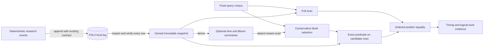

# S1: Scan versus conservative block summaries

## Scope and contract

This is the first implemented cell of the [observability storage agenda](observability-storage-research.md). The separate [preregistered protocol](storage-query-s1-protocol.md) fixes four synthetic workload shapes, three seeds, 2,048 events each, blocks of 64, 128 queries, five timed trials and two query modes. It measures logical query work over memory after verified FOL2 replay. It selects no storage format or application query API.

The [probe](../../../tools/storage-probe/README.md) owns rows and summaries in one immutable `Snapshot`. A query uses an inclusive time interval, optional tenant and optional exact case-sensitive whitespace token in a Log. Gauges do not match tokens. Both modes return positions in original arrival order, retaining duplicate event IDs. Missing summaries cause a full scan; no external or persisted metadata can be loaded. The proof and counterexamples are in the [research agenda](observability-storage-research.md#contract-before-acceleration).

<!-- diagram: ../../diagrams/storage-research.mmd -->


The [canonical diagram](../../diagrams/storage-research.mmd) is a research-tool projection, separate from the application system diagram.

## Implementation selection and correctness checks

An oracle author wrote the first six [contract tests](../../../tools/storage-probe/tests/contract.rs) before the implementation. Two independent Luna sampler candidates each passed those tests. An additional dense single-block probe tested inserted tokens and extreme tenant IDs with 8,192 rows and 128 queries. Both candidates passed all seven tests: `N=2`, observed pass fraction `2/2`; no tier escalation occurred. These are test outcomes, not an estimate of general model reliability.

Candidate A was retained for its `Option<Vec<BlockSummary>>` representation of summary absence, which avoids a separate enabled flag plus vector. Candidate B had fewer source bytes (5,632 versus 6,129 before formatting/documentation). Both satisfied the tested behavior. The [selection log](data/storage-query-s1-run-01/selection.json) preserves candidate source hashes, commands and outputs; only the chosen implementation is retained as executable repository code. Selection used no benchmark tuning.

In a scratch copy, changing the rejection branch to `if block_index == 0 || summaries[block_index].excludes(query)` made the contract command exit **101**, with six of seven tests failing. This deliberately loses known matches; its observed failure establishes that the oracle is not vacuous. An independent verifier reproduced it. Exact command/output is preserved in the selection log. The production probe never receives that defect.

The contract corpus covers extrema of `i64`, unsorted times, empty/partial blocks, duplicate IDs, Gauge/token exclusion, Unicode whitespace, punctuation, case, missing summaries and dense filters. The timed probe also independently evaluates each source query and compares every returned position, and verifies every replayed record with `same_record_contents`. A successful corpus does not establish safety for corrupted memory, external modification or future persisted metadata.

## Reproduction and measurement status

From the repository root:

```sh
python3 -B tools/bench/run_storage_s1.py target/storage-s1/run-02
python3 -B tools/bench/summarize_storage_s1.py target/storage-s1/run-02
```

Use a fresh directory. The runner executes root and research tests, analyzer tests, and a release build before measurement. It records source hashes and the frozen protocol, so the dirty starting revision can be reconstructed from the branch files and checked against the hashes. Generation is outside append timing; replay timing includes reopen, decode and exact verification; summary construction is measured separately. Query timing includes result allocation and excludes CSV output and oracle comparison. Peak process RSS and CPU usage cover the whole benchmark process, not an isolated index.

Run 01 executed `python3 -B tools/bench/run_storage_s1.py target/storage-s1/run-01` and exited **0**. It passed 24 root integration tests, seven research contract tests, six analyzer tests and the release build. The run began at `2026-09-27T09:14:06Z` and completed at `09:15:56Z`, including checks/build, on WSL2 Linux/ext4 with an Intel Core i7-10750H and Rust/Cargo 1.98.0. [Environment and exact source hashes](data/storage-query-s1-run-01/environment.json), [raw data](data/storage-query-s1-run-01/README.md), [analysis](data/storage-query-s1-run-01/summary.json) and the [frozen protocol](data/storage-query-s1-run-01/protocol.md) are preserved. All hashed source files matched the measured tree after execution.

There were 24,576 committed and exactly verified replayed events, 12 snapshots and 15,360 timed query executions. Every returned position vector equaled the independent source reference. All registered gates passed in every seed. In a copy of the measured CSV, changing the first row's `equal` field from `1` to `0` made the analyzer exit **1** with `result equality failed`; the [defect record](data/storage-query-s1-run-01/csv-mutation.json) preserves the exact command/output and original CSV hash. The original run files remained unchanged.

| Workload | Narrow-time rows avoided | Absent-token rows avoided | Common-token rows avoided | Raw log bytes / snapshot | Summary build, three seeds |
| --- | ---: | ---: | ---: | ---: | ---: |
| Gauge | 93.945% | 100% | 100% (no Logs match) | 303,104 | 39.3–145.8 µs |
| Clustered Logs | **93.945%** | **100%** | 0% | 575,130 | 928.5–2,206.5 µs |
| Shuffled Logs | **1.172–1.367%** | 100% | 0% | 575,130 | 735.5–1,022.4 µs |
| Mixed | 93.945% | 100% | 0% | 439,117 | 516.6–1,015.0 µs |

Each percentage aggregates the 16 queries in that case across five trials within a seed; ranges span the three seeds. All-range queries without predicates avoid zero rows for every workload. Common-token queries scan even the Gauge rows in each retained mixed block. Each snapshot has 32 summaries and **16,896 logical summary bytes** (bounds plus bitsets), excluded from the raw log size. These are separate RAM and file quantities, not a storage amplification ratio.

For context, median trial p99 across the fixed mixed query corpus ranged as follows. A trial's p99 is the nearest-rank statistic of 128 different queries; it is not a repeated single-query tail latency or a latency decision gate.

| Workload | Scan p99, seed range | Pruned p99, seed range |
| --- | ---: | ---: |
| Gauge | 10.2–11.1 µs | 10.2–10.9 µs |
| Clustered Logs | 463.2–1,155.0 µs | 113.3–237.5 µs |
| Shuffled Logs | 608.8–898.2 µs | 133.2–188.1 µs |
| Mixed | 384.4–514.3 µs | 35.1–72.5 µs |

The whole benchmark process used **2.213 user CPU seconds**, **4.726 system CPU seconds**, and **18,660 KiB peak RSS** according to the runner's child-specific `wait4` accounting. These [resource totals](data/storage-query-s1-run-01/resources.json) include append/replay, warmups, reference evaluation, output and queries. They do not isolate index memory or per-query CPU. Raw append timing and reopen/verification timing remain in [builds.csv](data/storage-query-s1-run-01/builds.csv); S1 did not vary append or durability and makes no ingestion improvement claim.

## Review

The GPT verifier ran the seven Rust tests, six Python tests and release build (all exit 0), independently reproduced the lost-block mutation (exit 101), and rejected a synthetic CSV mismatch. A Claude Sonnet review ran both test suites (exit 0) and resolved its initial missing-mutation-evidence finding after reading the preserved log. Both reported no blocking findings; neither ran the full durable benchmark. The integrator performed that run and the measured-CSV mutation above. The [review record](data/storage-query-s1-run-01/review.json) includes the initial Claude command denials and the successful retry using the exact allowed commands, without broader permissions.

Both reviewers also approved the final numerical evidence. The verifier recomputed the preserved summary exactly and checked all source/artifact hashes; Claude cross-checked the result tables and resolved the previously pending measured-CSV mutation item. Documentation validation and Rust formatting checks exited 0.

The result advances **only** the named logical-pruning cells to a disk-block investigation. The shuffled-time countercase shows why time bounds depend on clustering, and common-token queries show that a safe filter can be correct without saving work.

## Limits and next decision

The two query modes share the exact row evaluator; the independent reference lives in the probe and contract suite. The selected evaluator computes the token predicate even for rows that fail time or tenant checks. That affects CPU cost and leaves short-circuit evaluation as a separate future comparison; this run makes no universal latency claim.

All rows and summaries reside in RAM during queries. Both query modes share that same indexed snapshot; this is not an RSS comparison against a separately allocated raw-only baseline. Reopen scans the entire FOL2 file before any query and no on-disk reads are avoided by pruning. The Bloom filters and time summaries are tested together; this cell does not attribute savings among the three summaries or choose a Bloom size. Summary bytes are logical bitsets/bounds, not measured heap size or serialized amplification. Source input is small, synthetic and highly repetitive, cache state is warm, and the host is shared rather than an isolated benchmark machine.

Reopen occurs in the same benchmark process with a fresh log handle, not a separate process or physical power-loss test. Existing root CLI tests cover process restart. There is no concurrent ingestion, query snapshot publication, general deduplication, SQL/prefix/substring search, cold storage, compression comparison or time-to-searchable distribution. The all-summaries-disabled check is not a test of partially corrupted on-disk metadata. The next eligible experiment is an explicit immutable disk-block/publication contract and measured I/O; application adoption requires further evidence. Append-phase attribution remains an independent Stage 6 task.
