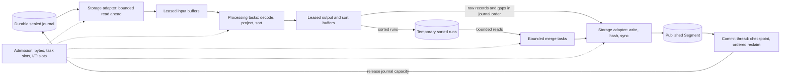

# Sealing pipeline: computational model and hypotheses

Status: **research proposal and analytical model; not implemented, model-checked or benchmarked**. This extends the [adaptive-sealing hypotheses](../experiments/benchmarks/adaptive-sealing-hypotheses.md) with storage-owned buffers and processing tasks. It provides a specification for later executable models and experiments, not a claim that an optimal implementation has been found.

Source checkpoint: `ba0c25da3124eddc753950cdf7846c4cd8086cf8`, with the [journal-reclaim candidate](../milestones/journal-reclaim-progress.md). Relevant source: [`sealer.rs`](../../crates/fabric-server/src/sealer.rs), [`segment.rs`](../../crates/fabric-server/src/segment.rs), [`rows.rs`](../../crates/fabric-server/src/rows.rs), [`store.rs`](../../crates/fabric-server/src/store.rs). The [product contract](../PRODUCT-CONTRACT.md), [Segment lifecycle](../decisions/ADR-0020-store-sealed-history-as-parquet-segments.md), [bounded-sealer ADR](../decisions/ADR-0022-build-segments-by-external-merge-sort.md) and [existing acceptance protocol](../milestones/bounded-sealer.md#registered-acceptance-protocol) are authoritative. This proposal does not amend them.

## 1. Objective and separation of concerns

In Satisfactory terms: the storage adapters operate freight unloaders, buffers and storage containers; processing workers execute recipes on supplied material; admission decides which machines may work. RAM is the limited material on the factory floor. Disk backlog stays in storage until there is room to process it.

Processing cannot use zero memory: it accesses inputs, output space, registers/cache and algorithmic scratch. The desired boundary is **no unaccounted payload retention or storage operations inside a transformation**, rather than zero working set. Making a component the nominal owner of a `Vec` does not reduce its allocation, copies or lifetime.

| Component | Owns | Must not implicitly accumulate |
| --- | --- | --- |
| Storage adapters | File handles, reads/writes, spill lifecycle, durable publication | Whole input/output files in anonymous buffers |
| Buffer owner | Allocation capacities, leases, reuse and release | Unbounded free lists, reference counts or cached payloads |
| Processing tasks | Transformation cursor and bounded scratch supplied for that task | Payloads between tasks, hidden queues or unbudgeted library workspaces |
| Output coordinator | Per-file order, run manifests, table writers, completion receipts | All completed rows waiting for a slow earlier task |
| Admission/scheduler | Ready descriptors, reservations, priorities and concurrency targets | Prefetched payloads disguised as cheap task metadata |
| Commit thread | Stream checkpoint and ordered journal deletion | Reclaim decisions based merely on a worker returning |

These are responsibilities within the existing native process, not a proposed set of services/crates, plugin interfaces or generic repository ports. Pure transformation does not automatically belong in `fabric-core`; storage-format mechanisms remain adapter concerns under [ADR-0016](../decisions/ADR-0016-keep-a-pure-semantic-core.md).

<!-- diagram: ../diagrams/sealing-pipeline-proposal.mmd -->


A stage is a logical responsibility. The minimal implementation may call stages synchronously on one thread. Dedicated loader threads, stage handoff queues and parallel tasks are individually testable mechanisms, not prerequisites for this separation.

## 2. Variables, units and assumptions

| Symbol | Meaning | Unit |
| --- | --- | --- |
| `F_j`, `N_j` | Input journal bytes and projected row count for file `j` | bytes, rows |
| `C` | Effective CPU capacity available to sealing after ingress headroom | CPU-seconds/second |
| `B_r`, `B_w`, `B_m` | Sustainable read, write and memory-traffic bandwidth for the measured mix | bytes/second |
| `M_s`, `D_s` | Global sealing allocation budget and temporary disk budget | bytes |
| `P`, `I_r`, `I_w`, `J` | Active processing tasks, outstanding reads/writes and active files | counts |
| `q_e`, `b_e`, `gamma_e` | Queue slots, allocation capacity/slot and byte expansion on edge `e` | count, bytes, ratio |
| `s_v`, `w_v`, `a_v` | Mean task service time, scratch bound and active task count at stage `v` | seconds, bytes, count |
| `X`, `lambda`, `r` | Completed input-byte-equivalent throughput, sealed arrivals and reclaimed journal bytes | bytes/second |
| `Q`, `A_Q` | Unreclaimed sealed journal bytes and their time integral | bytes, byte-seconds |
| `K`, `k`, `V` | Sorted-run count, maximum merge fan-in and total serialized run bytes | count, count, bytes |

Use *input journal bytes* as the common throughput denominator; record source-text bytes, encoded Batch bytes, rows and actual disk bytes separately. All CPU/I/O costs below are normalized by that same input denominator. Resource bounds refer to a declared workload profile: maximum frame/Batch/row sizes, identity cardinality, active files and codec versions. Existing caps bound encoded input; they do not automatically bound decoded heap by the same number of bytes.

Assume immutable sealed input, correct frame validation, one coordinator per file/attempt, atomic reservation decisions, fallible storage effects and a filesystem honoring successful syncs. Hardware power-loss behavior remains outside this analytical model. A finite model must state which failures, interleavings and sizes it enumerates.

## 3. Resource and queueing model

### 3.1 Memory is a conservation ledger

For every physical allocation, charge its capacity once, including when it is free-but-retained in a pool. Assign it to either owned buffers/arenas `A` or other accounted overhead `W`, never both. A lease is a permission to access that allocation, not a second charge. Future allocation reservations are separately charged until materialized:

```text
A(t) = sum(capacity(b) for allocated owned buffers/arenas b)
R(t) = sum(unmaterialized reservations)
W(t) = charged stacks, codec scratch and metadata outside A
A(t) + R(t) + W(t) <= M_s
```

Creating an allocation atomically converts reserved bytes into allocated capacity; it cannot temporarily count as neither. Growth reserves the increment first. Returning a buffer to a pool ends access but does not return allocated bytes to the free budget. Reusing an existing pool buffer requires a lease, not another allocation reservation. Deallocating it releases the allocation charge; RSS need not immediately decline. Every ownership transfer preserves the charge. This avoids both double-counting and spending the same memory twice.

A conservative static capacity envelope is:

```text
M_need = sum_e(q_e * b_e) + sum_v(a_v * w_v)
         + merge buffers + writer workspaces + bounded metadata + stacks
M_need <= M_s
```

Terms must be disjoint; leased inputs/outputs must not also be charged as private task payloads. Descriptor queues need bounds too. Borrowed views can pin a large backing allocation even when the view is small. Borrow fan-out charges that allocation once and prevents reuse until every consumer releases it.

Illustrative arithmetic only: four 4 MiB encoded slots (16), four 12 MiB decoded slots (48), two 24 MiB sort arenas (48), two 8 MiB output slots (16), eight 256 KiB merge-read buffers (2), eight 256 KiB maximum merge-head slots (2), four 2 MiB task scratch slots (8), two 12 MiB writer workspaces (24), and 16 MiB metadata total **180 MiB**. A hypothetical 256 MiB sealing budget leaves 76 MiB for additional accounted overhead/reserve. These are invented capacities for checking the model, not valid production sizes or the existing 80 MiB per-builder acceptance budget. In particular, 12 MiB decode slots require a demonstrated bound or incremental decoder.

For the whole process, plan a separate non-sealing reserve and track live heap, RSS and cgroup memory independently. Allocator fragmentation/retention, mapped pages, page cache and kernel charges prevent equating this ledger with RSS or `memory.current`. An OS limit is a final boundary, not evidence that admission prevented an OOM. Observe high-water and post-drain memory over repeated cycles.

### 3.2 Progress, latency and stability

For the frozen set plus new sealed files:

```text
Q(t) = Q(0) + A_sealed(t) - D_reclaimed(t)
A_Q(T) = integral from 0 to T of Q(t) dt
```

`A_sealed` and `D_reclaimed` are cumulative bytes; they jump at file events. This exact accounting avoids treating discrete deletion as a continuous rate. Publication progress is distinct: a published later file may be blocked behind an earlier unfinished one. Report both eligible duplicate byte-time and bytes blocked behind holes.

In a stable stationary regime, Little's law gives `L = lambda_jobs * W` for average jobs in a defined subsystem. Its byte-weighted analogue is average resident bytes = byte arrival rate times byte-weighted mean residence time, with consistent boundaries and conserved representation. It does not justify sizing buffers from averages alone. Bursts, variable expansion and heavy-tailed jobs require explicit caps and backpressure.

For a stage with service rate `mu_v` per worker, `rho_v = lambda_v / (a_v * mu_v)`. Stability requires offered work strictly inside every effective resource capacity region. Near saturation, queueing delay can rise sharply. For a single-server stage, the illustrative Kingman approximation is `W_q ~= ((c_a^2 + c_s^2)/2) * rho/(1-rho) * E[S]`; it is a GI/G/1 approximation under stationary renewal arrivals, independent service times with finite moments and `rho < 1`, not a measured ACK prediction or a formula for arbitrary worker pools. Under permanent overload, finite backlog requires refusing/deferring upstream work; thread creation cannot restore stability by itself.

### 3.3 Throughput ceilings and prefetch

Let `c` be CPU-seconds, `r_b/w_b` actual disk bytes and `m_b` memory-traffic bytes per input byte. An optimistic bound is:

```text
X <= min(C/c, B_r/r_b, B_w/w_b, B_m/m_b, min_v(stage_v input-byte capacity))
```

On one shared storage device, separate read/write ceilings are insufficient. A first-order service-demand approximation is `X * (r_b/B_r + w_b/B_w) <= 1`; validate it on the actual mixed I/O workload, including syncs and ingress. Cache effects, queue depth and nonlinear latency can make either approximation loose. More workers can increase `c` and `m_b` through scheduling/cache contention, so capacity is not generally linear in thread count.

For an ideal two-stage read/process pipeline with equal-sized chunks and unlimited resource independence:

```text
T_serial/chunk = t_read + t_process
T_overlap/chunk >= max(t_read, t_process)
ideal speedup <= (t_read + t_process) / max(t_read, t_process) <= 2
```

Startup/drain, writing, shared CPU/device contention and synchronization lower the gain. Prefetch is useful only while it hides otherwise exposed wait. To cover read latency `L_r` at input rate `X`, its encoded-byte inventory is roughly `X * L_r`; decoded inventory must include expansion and burst margin. This is a sizing heuristic, not permission to exceed the ledger. Stop prefetch at the byte/slot boundary regardless of CPU idleness.

### 3.4 Bounded external sort

For each sorted signal table, let the in-memory run capacity be `S` bytes of actual row storage. Generate byte-bounded sorted runs; keep exact Batch bytes and gaps on their separate journal-order output path. Because serialized runs and allocated rows differ, estimate `K` from the actual run generator, not simply `ceil(F_j/S)`.

With fan-in `k >= 2`, each merge task needs at least `k * (read_buffer + maximum_head_row) + output_buffer + heap_metadata + codec_scratch`. Bound every term and open at most `k` readers. Catalogs of arbitrarily many runs must themselves be streamed/spilled, and per-identity freshness metadata must be bounded by the profile or externally aggregated. Thread stacks, file descriptors and active file coordinators are additional bounded resources.

For `K >= 2`, approximately `p = ceil(log_k K)` merge passes are required. If every pass carries the same serialized sorted volume `V`, initial spill plus intermediate/final merge reads/writes move roughly `2 * p * V` temporary bytes in total (final table output counted separately). Add input `F_j`, final Segment bytes, raw/gap output and metadata. Compression and uneven runs change actual volumes. If a file fits one run, a no-spill fast path can avoid this cost.

Comparison sorting requires `Omega(N log N)` comparisons in the general unsorted-key model. External-memory comparison sorting has an I/O bound of order `(N/B) * max(1, log_(M/B)(N/B))` block transfers under fixed-size records/keys and the standard memory model. Variable-length rows, encoding and compression add costs. Bounded multi-pass merge can approach this class without retaining a whole file; it does not establish optimality for every real corpus or possible radix/partition algorithm.

Increasing fan-in can remove a pass and save substantial I/O, but consumes memory and reader slots. Increasing run size can reduce `K` but leave fewer processing jobs active. These choices must be optimized jointly. ADR-0022's open-all-runs design has a per-run term; this stronger bounded-fan-in proposal needs an explicit design revision before product implementation. The current sorted spans table also needs coverage; the older logs/metrics design cannot silently stand in for it.

## 4. Operational semantics and ownership

A chunk descriptor contains `(journal_label, attempt, frame_offset, chunk_ordinal, input_range, lease_generation)`. It is bounded metadata, not an owned copy of the shipment. A buffer allocation has state `Free`, `Exclusive(task)`, `Shared(readers)` or `PendingIO(request)`. Generation tags reject stale descriptors after reuse. Writer/reader tasks may share immutable data; exclusive mutation cannot coexist with any reader or outstanding I/O.

Conceptual processing signature, not a proposed public API:

```text
transform(input_view, exclusive_output_lease, scratch_lease, cursor)
    -> Completed(receipt)
     | Yield(next_cursor, committed_output_extent)
     | InvalidInput(reason)
```

The task receives all memory it may use before it starts, performs no explicit filesystem/network operation, and returns without retained payload references. A yield is at a defined record boundary; the coordinator commits its progress receipt once, so resumed work neither loses nor duplicates rows. Output that cannot fit one legal record must request a prebounded oversize slot before processing, use an incremental representation, or fail the build visibly while preserving the journal. New silent truncation or data dropping is forbidden.

Rust scoped borrows, owned lease handles and drop guards can enforce much of this locally. Existing `prost` decoding and row extraction allocate owned objects; merely changing signatures to slices does not eliminate those allocations. Either bound/account the existing decode workspace or implement a separately verified incremental representation. Borrowed input plus an owned output may be cheaper than copying everything, but can prolong input-buffer retention; measure both traffic and lifetime.

| Transition | Guard | Effect |
| --- | --- | --- |
| AdmitRead | Valid descriptor; free input lease; I/O slot; ledger allows any allocation | Mark lease PendingIO; issue bounded read |
| ReadDone | Matching request and generation; valid frame | Make immutable input ready; release read slot |
| AdmitTask | Input ready; atomically available output, scratch, task slot and expansion budget | Lease all resources; enqueue/run transformation |
| TaskDone/Yield | Matching attempt; valid output extent and receipt | Transfer output lease to its sink; advance cursor once; release input only after all readers finish |
| Spill/WriteDone | Storage operation has completed and no retained borrow remains | Release/reuse payload lease; retain only bounded catalog/progress metadata |
| Merge | At most `k` run readers plus reserved head/output/workspace capacity | Emit bounded sorted output; recycle buffers as consumers complete |
| Publish | All expected records accounted for; writers completed; required sync/manifest/rename sequence succeeds | Mark Segment durably published |
| Reclaim | Label is oldest sealed file and its Segment is published | Request existing commit-thread checkpoint then deletion; advance prefix only on success |
| Fail/Cancel | Any task/storage error or shutdown | Stop new admissions for attempt; join/cancel and observe outstanding I/O before releasing its buffers; preserve journal |
| Retry/Restart | Previous attempt cannot still publish; cleanup follows existing rules | New attempt identifier; discard incomplete scratch; rebuild or reuse published Segment |

No acknowledgement is introduced at a chunk/stage boundary. Intake ACK semantics stay with the durable journal. Unfinished sorting runs are recoverable scratch, not a new durable source of truth.

### Deadlock and ordering obligations

A single undifferentiated pool is unsafe: with capacity two, two reads can each hold one slot while both require another output slot to finish. Neither can release its input. More workers cannot resolve that state.

Use atomically acquired complete task resource sets, bounded queues, and protected drain capacity. Upstream read admission cannot consume the output/write/merge capacity needed to finish already admitted work. A compute worker never blocks while trying to acquire a second resource set or waiting on storage; tasks that lack capacity remain scheduler descriptors. Writer completion and I/O completion must not require a blocked compute worker to run. Validate the resulting wait-for graph; stage separation alone is not a deadlock proof.

Raw records and gaps must retain journal order. Assign ordinals and bound the reorder window; prefer contiguous input partitions and stop issuing far-ahead chunks when the earliest unfinished ordinal stalls. Sorted logs/metrics/spans use their existing total order keys, including identity, sequence and row index. Merge them globally per table; independently sorted output chunks are insufficient. Exercise any legal equal-key cases against the current stable sort; carry source ordinals as an internal merge tie-breaker where needed to reproduce that behavior, without inventing a new public order. Deterministic partition/group boundaries must be defined where byte-for-byte output repeatability is required, irrespective of completion order.

Limit the number of active files and lookahead beyond the reclaim frontier. Favor tasks that release occupied buffers and advance the oldest unfinished file, with aging for other admitted work. A large oldest file may limit reclaimed throughput even when small later files publish quickly. Compare this policy experimentally; earliest-file priority is not universally throughput-optimal.

## 5. Candidate algorithm

```text
initialize bounded pools, explicit workspace budgets and bounded descriptor queues
reserve independent drain capacity; leave intake memory/CPU/I/O headroom

on read completion, task receipt, write completion or control sample:
    validate attempt/generation; apply each progress receipt once
    complete ownership transfers and release finished I/O/task slots
    request ordered reclaim only for the durably published oldest prefix

    update demand and measured pressure; keep a fixed hard resource envelope
    choose desired CPU-task concurrency and bounded read/write depth
    prioritize drain/write tasks, then progress of the oldest unfinished file

    while an eligible task has a complete feasible resource set:
        atomically lease input/output/scratch and any future allocation bytes
        dispatch transformation; it returns or yields without waiting for I/O

    while prefetch is needed and input/I/O capacity exists:
        admit a bounded read within the allowed ordinal/file lookahead

    when a run fills, sort it using reserved scratch; submit its spill write
    when file input is exhausted, merge runs in groups of at most k
    stream bounded table output, hashes, filters and manifest metadata
    publish using existing durable sequence; cleanup/retry on failure
```

A hysteretic controller uses explicit samples: ready backlog, observed CPU demand, memory reservations, I/O pressure and ACK latency. Increase one task at a time only after persistent demand/headroom; reduce desired admissions on pressure, and allow existing bounded tasks to complete. Freeze sample windows, thresholds and cooldowns in the executable protocol. Missing/stale signals forbid expansion. No PID/gain choice is claimed stable without modelling actuator delay and measuring response. A lower desired count does not instantly reclaim RSS.

Progress is conditional: at least one complete task/drain set fits the configured budget; admitted I/O and transformations eventually return; scheduling is fair; storage capacity eventually exists; persistent oldest-file errors are surfaced rather than ignored. If a legal frame/row cannot fit even one task, the configuration is infeasible and must be rejected or reported, not spun indefinitely.

## 6. Safety properties and analytical proof obligations

These are proposed model properties, not additions to the product's verified-invariant registry.

| ID | Property | Why it might hold; what must be checked |
| --- | --- | --- |
| P1 | Allocation plus reservation ledger never exceeds `M_s` | Induction over atomic reserve/materialize/grow/free transitions; every library allocation and retained pool capacity must be covered |
| P2 | No buffer is reused while borrowed or referenced by I/O | Exclusive/shared/PendingIO guards, generation checks and release after completion; test cancellation races |
| P3 | Exact Batch bytes and projected records are neither lost nor duplicated | Immutable input ranges, unique ordinals, once-applied progress receipts and full accounting at publication; verify against independent oracles |
| P4 | Output is globally ordered and semantically equivalent | Correct run sort plus correct bounded merge plus deterministic order-preserving raw/gap path |
| P5 | Reclaim never crosses an unpublished hole or failed checkpoint | Existing commit operation and monotonically advancing oldest-label frontier |
| P6 | Memory cannot deadlock admitted work | Feasible complete resource bundles, drain reservation, bounded reorder window and fair completion; explicitly enumerate the wait graph |
| P7 | Every eligible file eventually publishes/reclaims | Conditional on termination, sufficient recurring resources and no permanent earlier failure; not true under arbitrary failures |
| P8 | Long-run memory does not grow with completed job count | No escaped leases, bounded catalogs/pools and bounded allocator retention under the tested allocator; measured RSS needs separate evidence |

P1 is a ledger property, not an unconditional process-memory theorem. P4's induction on merge steps does not prove actual codec correctness. P6/P7 need a concrete transition system and fairness assumptions. Neither compiler borrowing nor a finite model establishes all these properties on its own.

## 7. Optimization problem

Let `theta = (P, I_r, I_w, J, chunk sizes, queue capacities, S, k, lookahead, scheduling policy)` and let `w` describe the workload and host. Define feasible configurations by correctness, declared memory/disk ceilings, bounded queues, an ACK-latency limit and output-equivalence requirements. Codec/schema/sync changes are outside this search.

First estimate the feasible throughput frontier:

```text
maximize X(theta, w)
subject to M_peak <= M_limit, D_peak <= D_limit,
           ACK_p99 <= L_limit, all correctness properties satisfied
```

Under a fixed offered load below saturation, maximizing throughput alone is uninformative: every adequate configuration can return the same work. Then minimize `(A_Q, CPU_seconds/input_byte, actual_IO/input_byte, resident_byte_seconds)` subject to the same constraints. Report the Pareto frontier: a candidate dominates another only when it is no worse on all declared objectives and better on at least one. Choose an operating point from explicit priorities; do not invent a weighted score after seeing results.

For saturation tests, report offered/admitted/committed/published/reclaimed rates and backlog. Refusing more traffic or excluding retry time must not manufacture an efficiency win. Optimize over a workload distribution or publish the regions where each configuration wins; a universal fastest algorithm is not inferred from one fixture.

## 8. Hypotheses from different perspectives

All margins below are **proposed engineering thresholds** for future registration. Correctness and resource violations reject a candidate independently of statistical significance. `R_Y = E[Y_candidate]/E[Y_control]` within one frozen workload population, with a positive meaningful denominator.

| Perspective | Alternative H1 | Null H0 | Isolated comparison and main cost |
| --- | --- | --- | --- |
| Separation/ownership | Accounted leased buffers reduce copied bytes per input byte by >20%, without increasing peak memory or violating guardrails | `R_copy >= 0.80` | Same bounded algorithm with owned-copy versus leased-view handoff; longer input pinning can erase the benefit |
| Storage overlap | Bounded prefetch improves saturated completed sealing throughput by >10% | `R_X <= 1.10` | Same bounded builder/pools, synchronous reads versus prefetch; extra I/O depth can hurt ingress |
| CPU scheduling | Fixed pull tasks improve throughput by >10% on heterogeneous job durations | `R_X <= 1.10` | Fixed group versus fixed pull with matched memory and worker ceilings; no adaptive controller |
| Control theory | Adaptive admission lowers burst backlog area by >20% | `R_AQ >= 0.80` | Adaptive versus calibrated fixed pull policy; oscillation and delayed metrics can worsen latency |
| Algorithmic memory | Existing finite bounded-sealer limits hold: <=80 MiB incremental single-builder heap and <=10% growth from 64 to 256 MiB on its registered shapes | Some registered case exceeds either limit | Existing builder versus bounded algorithm at one worker; finite acceptance only, not a statistical claim of all-input bounds |
| Global buffer budgeting | P1/P2/P6 hold for all enumerated model states; native allocation stays inside its declared envelope | A reachable violating state or native budget breach exists | Logical falsification, not a p-value; attack unaccounted allocations, shared references and cancellation |
| External-memory algorithms | The selected feasible `(S,k)` has measured I/O within 10% of the lowest-I/O feasible control in the frozen grid while passing latency/memory guards | `R_IO >= 1.10` | Hold ordering/codec constant; independently calibrate and freeze the comparator to avoid selection bias |
| Reclaim-aware fairness | Bounded lookahead/oldest-file progress lowers unreclaimed backlog area by >20% on mixed-duration files | `R_AQ >= 0.80` | Same task pool, FIFO-ready versus proposed priority; may reduce total publication throughput |
| Resource lifetime | Post-drain resident-memory slope is below a predeclared practical margin `delta_M` after warmup | Slope `>= delta_M` | Repeated equal-shape cycles; separate live heap from allocator retention and page cache |

The end-to-end claim is stronger than any row: gains must survive the complete ingest-to-reclaim path at the same offered workload and resource envelope. Query execution is excluded from the primary performance scope, while existing query/delivery tests remain correctness checks on stored output. History/filter semantics still constrain the algorithm.

Proposed cross-cutting guards: no lost/changed/duplicated retained ACKed records; no budget breach or deadlock; ACK p99 no more than 10% worse; no more than 5% throughput regression in feasible steady-load cells. Freeze absolute limits as well as relative margins, and account for incomplete offers. A ratio over a zero or near-zero denominator is undefined/uninformative and needs an explicitly registered absolute alternative.

## 9. Computational and experimental validation design

The companion [experiment design and optimization route catalog](../experiments/benchmarks/sealing-pipeline-experiment-design.md) rotates through the design space, defines interactions to screen and records proposed routes with explicit rejection criteria.

### Model first

Specify a finite transition model with two files, up to three ordered chunks each, two processing slots, three buffer classes with capacities in units, fan-in two, and nondeterministic task/I/O completion. Track physical ownership, shared borrows, reservations, generation/attempt numbers, output ordinals and durable frontiers. Enumerate normal/error/panic/cancel/retry paths and metric delay/jitter. Check P1–P6 as safety/state properties; check conditional P7 only under explicit fairness. Increase bounds and record state counts, counterexample traces and tool versions. No model checker has been run for this document.

Required rejecting controls: read admission spends drain reserve; outputs allocate without reservation; premature reuse during pending I/O; two chunks apply the same receipt; raw output bypasses an earlier ordinal; a late old-attempt result publishes; a merge reads all runs despite `k`; reclaim crosses a missing label; errors leak leases. The two-input/no-output deadlock is a mandatory fixture. A checker without a rejecting control supplies weak evidence.

A discrete-event performance simulator can explore `theta` cheaply using separately measured distributions for read/process/write cost, row expansion and contention. Represent shared disk and CPU resources and queue limits explicitly; independently validate against held-out native traces. Simulator winners only nominate native experiments. Do not use assumed constant service times to claim a real-host speedup.

### Isolate mechanisms before combining them

Use a sequential byte-bounded builder as the reference for loader/pipeline changes. Compare, in order: whole-file versus bounded builder; bounded synchronous versus bounded prefetch; copy versus leased views; fixed group versus fixed pull; fixed versus adaptive admission. Hold each other mechanism fixed. Run a small factorial follow-up for prefetch x concurrency x memory budget to detect interactions before combining all features. Include one-file/one-chunk controls where parallelism should not help.

Workload axes: quiet/steady/burst/overload; low/high row expansion and identity cardinality; ordered versus shuffled timestamps; heterogeneous file sizes; CPU-bound compression; injected read/write delay with low CPU; tight memory and disk ceilings; repeated build/drain cycles. Use valid logs, metrics, spans and gaps. Verify all baseline/candidate output against identical frozen input manifests and independent semantic oracles. Sources must continue accounting for scheduled offers while delivery backs up.

### Statistical decision, including a meaningful null

Preserve the earlier backlog claim's ratio-of-expectations estimand. For paired burst trials define `D_i = A_Q,candidate,i - 0.80 * A_Q,control,i`; H0 is `E[D] >= 0`. A predeclared one-sided confidence bound below zero supports a >20% gain. Do not silently substitute a geometric mean of per-trial ratios. Similarly, a throughput claim can test `D_i = X_candidate,i - 1.10 * X_control,i` with the opposite direction.

Use disjoint pilot/calibration and confirmation data. Randomize paired order within host/load blocks; freeze warmup and cache-state handling. Trial/block is the unit of replication, not each Batch from the same run. Account for serial correlation across successive trials; repeating on one host does not establish generalization across hardware. Declare confidence methods for skewed/heavy-tailed outcomes and paired dependence before confirmation; retain outliers unless a predeclared invalidation rule applies.

For a paired-mean design, a pilot approximation is `n >= ((z_(1-alpha) + z_(1-beta)) * sigma_D / Delta)^2`, then account for finite-sample behavior and blocking. `Delta` is distance of the planned true effect from the null boundary. **80% power cannot be planned at the boundary itself:** for H0 backlog ratio >=0.80, choose a design alternative such as 0.70, estimate its variance, then freeze `n`. Historical performance supplies neither that variance nor the proposed effect. This refines the earlier planning shorthand about power at a 20% margin.

Choose one primary confirmatory claim; for simultaneous additional claims control the declared family error, for example Holm at 0.05. Noninferiority guardrails also need predeclared confidence rules. Report all comparisons, including no effect, regression and inconclusive results. Failure to reject H0 is not proof of equivalence. Right-censored offers stay in the report; if their possible latency changes the decision, that cell is inconclusive or fails its completion gate.

### Measurements and execution boundary

Record peak and time-series ledger/live heap/RSS/cgroup memory, copied bytes, allocated capacity and allocation count, task/queue occupancy, CPU seconds, context switches, actual read/write/spill bytes, I/O wait/pressure, ACK lifetimes and publication/reclaim events. Allocator/copy instrumentation itself can perturb execution; apply it to both variants, measure overhead, and use separate declared measurement modes where necessary. An unavailable counter is unavailable evidence.

Freeze executable commands, source/fixture hashes, release/toolchain flags, host quota/affinity, filesystem and resource budgets before timing. The present cloud environment supports deterministic models, bounded allocation fixtures and exploratory native runs. PC runs establish hardware-specific trade-offs and long-run behavior on its actual storage. Use the [existing proposal's local resource limits](../experiments/benchmarks/adaptive-sealing-hypotheses.md#local-environment-and-pc-boundary), adapting scope only through a new registered protocol. Native processes suffice; no service installation is required.

## 10. Implementation obligations and evidence status

A later implementation should first demonstrate a sequential bounded path with correct exact-byte retention, all signal tables, filters, manifest metadata and failure cleanup. Then add the ownership ledger and prove its coverage by allocation measurement and injected violations. Introduce prefetch and parallel tasks one at a time. Adaptive admission comes after resource envelopes and bottlenecks are measured. New public configuration, crate boundaries, allocation dependencies or accepted-design changes require their own scoped decisions.

The old bounded-sealer proposal assumes one builder and opens every run. This proposal explores multiple bounded tasks and capped merge fan-in. It must reconcile those differences and spans/metadata accounting explicitly before claiming compliance with that milestone. Existing qualification, oracle, sync-order and acceptance rules have not been edited.

Analytical examples above are derived under stated assumptions. Documentation validation checks links/diagram copies, not the model's truth. **No solver, simulator, allocation experiment or performance comparison has run for this model.** Its deliverable is the computational specification, falsifiable hypotheses and experiment design; the optimal operating point remains to be measured.
